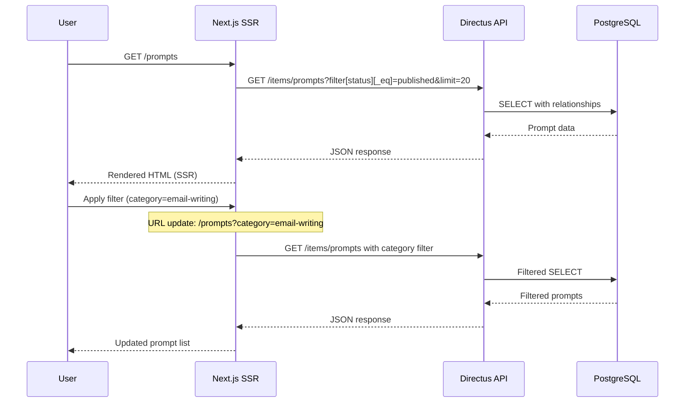
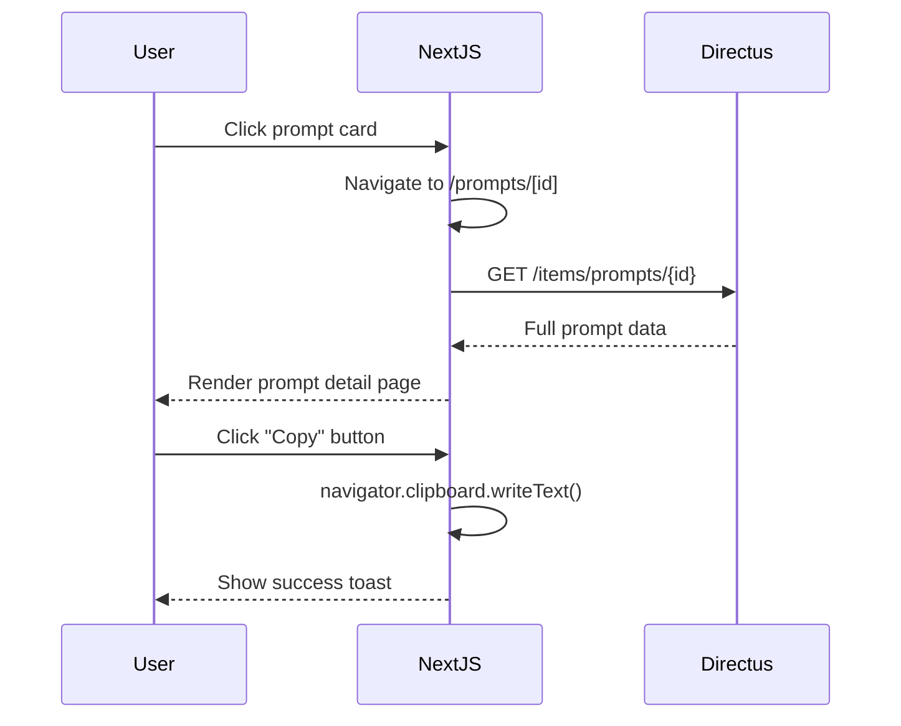

# Epic 1: Foundation & Prompt Display System
## Architecture Shard

**Epic Scope:** Set up Next.js application, connect to Directus, implement basic prompt browsing (no auth, public access).

**Stories Covered:** Stories 1-8 from PRD Epic 1

---

## Quick Context

This shard covers the foundational infrastructure and basic prompt display functionality. At the end of this epic, users can browse published prompts on a public website with filtering by category, role, and difficulty.

**What's IN scope:**
- Next.js 14+ with App Router setup
- Directus Cloud connection and schema creation
- Prompt, Category, JobRole data models
- Public prompt browsing (all prompts visible)
- Basic filtering and pagination
- Copy-to-clipboard functionality
- Deploy to Vercel

**What's OUT of scope (later epics):**
- User authentication (Epic 3)
- Freemium access control (Epic 3)
- Search functionality (Epic 2)
- Payment integration (Epic 4)
- Prompt migration scripts (Epic 2)

---

## Tech Stack for Epic 1

| Technology | Version | Purpose |
|-----------|---------|---------|
| Next.js | 14.2+ | React framework with App Router |
| TypeScript | 5.3+ | Type-safe development (strict mode) |
| Tailwind CSS | 3.4+ | Utility-first styling |
| Directus | 10.10+ | Headless CMS and BaaS |
| PostgreSQL | 14+ | Database (managed by Directus) |
| Directus SDK | 16.0+ | API client for Directus |
| Vercel | Latest | Hosting and deployment |
| React Hook Form | 7.50+ | Form handling (filter form) |
| Headless UI | 2.0+ | Accessible UI components |

---

## Data Models

### Prompt

```typescript
// types/Prompt.ts
export type DifficultyLevel = 'beginner' | 'intermediate' | 'advanced';
export type PromptStatus = 'draft' | 'published' | 'archived';

export interface Prompt {
  id: string;
  title: string;
  description: string;
  prompt_text: string;
  difficulty_level: DifficultyLevel;
  status: PromptStatus;
  date_created: string;
  date_updated: string;
  sort: number | null;

  // Relationships
  categories?: Category[];
  job_roles?: JobRole[];
}

// List view (optimized for browsing)
export interface PromptCard {
  id: string;
  title: string;
  description: string;
  difficulty_level: DifficultyLevel;
  categories?: Pick<Category, 'id' | 'name' | 'slug'>[];
  job_roles?: Pick<JobRole, 'id' | 'name' | 'slug'>[];
}
```

### Category

```typescript
// types/Category.ts
export interface Category {
  id: string;
  name: string;
  slug: string;
  description: string | null;
  sort: number | null;
}
```

### JobRole

```typescript
// types/JobRole.ts
export interface JobRole {
  id: string;
  name: string;
  slug: string;
  description: string | null;
  sort: number | null;
}
```

---

## Database Schema (Epic 1)

```sql
-- CATEGORIES TABLE
CREATE TABLE IF NOT EXISTS categories (
    id UUID PRIMARY KEY DEFAULT gen_random_uuid(),
    name VARCHAR(100) NOT NULL UNIQUE,
    slug VARCHAR(100) NOT NULL UNIQUE,
    description TEXT,
    sort INTEGER,
    date_created TIMESTAMP WITH TIME ZONE DEFAULT CURRENT_TIMESTAMP,
    date_updated TIMESTAMP WITH TIME ZONE DEFAULT CURRENT_TIMESTAMP
);

-- JOB ROLES TABLE
CREATE TABLE IF NOT EXISTS job_roles (
    id UUID PRIMARY KEY DEFAULT gen_random_uuid(),
    name VARCHAR(100) NOT NULL UNIQUE,
    slug VARCHAR(100) NOT NULL UNIQUE,
    description TEXT,
    sort INTEGER,
    date_created TIMESTAMP WITH TIME ZONE DEFAULT CURRENT_TIMESTAMP,
    date_updated TIMESTAMP WITH TIME ZONE DEFAULT CURRENT_TIMESTAMP
);

-- PROMPTS TABLE
CREATE TABLE IF NOT EXISTS prompts (
    id UUID PRIMARY KEY DEFAULT gen_random_uuid(),
    status VARCHAR(20) DEFAULT 'draft',
    title VARCHAR(200) NOT NULL,
    description VARCHAR(500) NOT NULL,
    prompt_text TEXT NOT NULL,
    difficulty_level VARCHAR(20) NOT NULL,
    sort INTEGER,
    date_created TIMESTAMP WITH TIME ZONE DEFAULT CURRENT_TIMESTAMP,
    date_updated TIMESTAMP WITH TIME ZONE DEFAULT CURRENT_TIMESTAMP
);

-- JUNCTION TABLES
CREATE TABLE IF NOT EXISTS prompt_categories (
    id SERIAL PRIMARY KEY,
    prompts_id UUID NOT NULL REFERENCES prompts(id) ON DELETE CASCADE,
    categories_id UUID NOT NULL REFERENCES categories(id) ON DELETE CASCADE,
    UNIQUE(prompts_id, categories_id)
);

CREATE TABLE IF NOT EXISTS prompt_job_roles (
    id SERIAL PRIMARY KEY,
    prompts_id UUID NOT NULL REFERENCES prompts(id) ON DELETE CASCADE,
    job_roles_id UUID NOT NULL REFERENCES job_roles(id) ON DELETE CASCADE,
    UNIQUE(prompts_id, job_roles_id)
);

-- INDEXES
CREATE INDEX idx_prompts_status ON prompts(status);
CREATE INDEX idx_prompts_date_created ON prompts(date_created DESC);
CREATE INDEX idx_categories_sort ON categories(sort);
CREATE INDEX idx_job_roles_sort ON job_roles(sort);
```

---

## API Endpoints (Epic 1)

### Directus REST API

**Base URL:** `https://your-instance.directus.app`

#### 1. List Prompts (with filtering)

```http
GET /items/prompts?filter[status][_eq]=published&limit=20&offset=0&fields=*,categories.categories_id.*,job_roles.job_roles_id.*
```

**Query Parameters:**
- `filter[status][_eq]=published` - Only published prompts
- `filter[difficulty_level][_eq]=beginner` - Filter by difficulty
- `filter[categories][categories_id][slug][_eq]=email-writing` - Filter by category slug
- `filter[job_roles][job_roles_id][slug][_eq]=manager` - Filter by job role slug
- `limit=20` - Pagination limit (20 per page)
- `offset=0` - Pagination offset
- `fields=*,categories.categories_id.*,job_roles.job_roles_id.*` - Include relationships

**Response:**
```json
{
  "data": [
    {
      "id": "uuid",
      "title": "Professional Email Template",
      "description": "Craft professional emails for business communication",
      "prompt_text": "Full prompt text here...",
      "difficulty_level": "beginner",
      "status": "published",
      "date_created": "2025-11-09T10:00:00Z",
      "categories": [
        {
          "categories_id": {
            "id": "uuid",
            "name": "Email Writing",
            "slug": "email-writing"
          }
        }
      ],
      "job_roles": [
        {
          "job_roles_id": {
            "id": "uuid",
            "name": "Manager",
            "slug": "manager"
          }
        }
      ]
    }
  ],
  "meta": {
    "total_count": 150,
    "filter_count": 25
  }
}
```

#### 2. Get Single Prompt

```http
GET /items/prompts/{id}?fields=*,categories.categories_id.*,job_roles.job_roles_id.*
```

#### 3. List Categories

```http
GET /items/categories?sort=sort,name
```

#### 4. List Job Roles

```http
GET /items/job_roles?sort=sort,name
```

---

## Frontend Architecture

### Repository Structure (Epic 1)

```
chargpt-bible-frontend/
├── app/
│   ├── page.tsx                  # Landing page (static)
│   ├── layout.tsx                # Root layout
│   └── prompts/
│       ├── page.tsx              # Prompt library (SSR)
│       └── [id]/
│           └── page.tsx          # Prompt detail (SSR)
├── components/
│   ├── layout/
│   │   ├── Header.tsx
│   │   └── Footer.tsx
│   ├── prompts/
│   │   ├── PromptCard.tsx        # Prompt card component
│   │   ├── PromptList.tsx        # Prompt grid/list
│   │   ├── PromptFilters.tsx     # Filter sidebar
│   │   ├── PromptDetail.tsx      # Full prompt display
│   │   └── CopyButton.tsx        # Copy-to-clipboard button
│   └── ui/
│       ├── Button.tsx
│       ├── Badge.tsx
│       └── Select.tsx
├── lib/
│   ├── directus.ts               # Directus client setup
│   ├── services/
│   │   └── prompts.ts            # Prompt service layer
│   └── utils/
│       └── format.ts             # Formatting utilities
├── types/
│   ├── Prompt.ts
│   ├── Category.ts
│   └── JobRole.ts
├── .env.local.example
├── next.config.js
├── tailwind.config.js
└── tsconfig.json
```

### Component Architecture

**Key Components:**

1. **PromptCard** (Client Component)
   - Props: `prompt: PromptCard`
   - Displays: title, description, difficulty badge, category/role tags
   - Action: Click to view full prompt

2. **PromptFilters** (Client Component)
   - Props: `categories: Category[], jobRoles: JobRole[], onFilterChange`
   - Controls: Category select, Role select, Difficulty select, Reset button
   - State: URL search params (shareable links)

3. **CopyButton** (Client Component)
   - Props: `text: string`
   - Uses: Navigator Clipboard API
   - Feedback: Toast notification on copy

4. **PromptList** (Server Component)
   - Props: `prompts: Prompt[], pagination: PaginationMeta`
   - Layout: Responsive grid (1 col mobile, 2 col tablet, 3 col desktop)
   - Pagination: "Load More" button or page numbers

---

## Core Workflows

### 1. Browse Prompts (Public User)



### 2. View Prompt Detail



---

## Environment Configuration

**Required Variables (Epic 1):**

```bash
# .env.local
NEXT_PUBLIC_DIRECTUS_URL=https://your-instance.directus.app
DIRECTUS_URL=https://your-instance.directus.app
DIRECTUS_ADMIN_TOKEN=your_admin_token
NEXT_PUBLIC_BASE_URL=http://localhost:3000
```

**Note:** Stripe and auth variables added in later epics.

---

## Development Workflow

### Setup Steps (Epic 1)

1. **Initialize Next.js Project**
   ```bash
   npx create-next-app@latest chargpt-bible-frontend --typescript --tailwind --app --no-src-dir
   cd chargpt-bible-frontend
   ```

2. **Install Dependencies**
   ```bash
   npm install @directus/sdk
   npm install react-hook-form zod
   npm install @headlessui/react @heroicons/react
   ```

3. **Set Up Directus**
   - Create Directus Cloud instance
   - Create collections: `prompts`, `categories`, `job_roles`, junction tables
   - Configure RBAC: Public role can read published prompts
   - Seed initial data (5-10 prompts for testing)

4. **Configure Directus Client**
   ```typescript
   // lib/directus.ts
   import { createDirectus, rest } from '@directus/sdk';

   export const directus = createDirectus(process.env.NEXT_PUBLIC_DIRECTUS_URL!)
     .with(rest());
   ```

5. **Deploy to Vercel**
   ```bash
   vercel
   # Follow prompts to link project
   ```

---

## Security Considerations (Epic 1)

**Current Phase:**
- **Public access:** All published prompts are publicly readable
- **No authentication:** Users don't need accounts yet
- **Rate limiting:** Directus default (100 req/min per IP)
- **XSS protection:** React auto-escaping handles user-generated content display
- **HTTPS:** Enforced by Vercel automatically

**RBAC Configuration (Directus):**
- **Public Role:**
  - Read access: `prompts` (status=published), `categories`, `job_roles`
  - No write access
  - No user data access

---

## Performance Targets (Epic 1)

- **Landing page load:** <2 seconds (static generation)
- **Prompt library load:** <3 seconds (SSR with 20 prompts)
- **Filter response:** <500ms (client-side URL update + SSR)
- **Prompt detail load:** <2 seconds (SSR single item)
- **Lighthouse score:** 90+ (Performance, Accessibility, SEO)

**Optimization Techniques:**
- Static generation for landing page
- Server-side rendering for prompt pages (SEO)
- Pagination (20 prompts per page)
- Image optimization (Next.js Image component)
- Tailwind CSS purging (automatic)

---

## Testing Checklist (Epic 1)

**Manual Tests:**
- [ ] Landing page loads successfully
- [ ] Navigate to /prompts - see list of prompts
- [ ] Prompt cards display title, description, difficulty, tags
- [ ] Click prompt card - navigate to detail page
- [ ] Prompt detail shows full prompt_text
- [ ] Copy button copies prompt to clipboard
- [ ] Filter by category - URL updates, prompts filtered
- [ ] Filter by job role - prompts filtered correctly
- [ ] Filter by difficulty - works as expected
- [ ] Pagination shows 20 prompts per page
- [ ] Mobile responsive (test at 360px width)
- [ ] Lighthouse score >90

---

## Key Code Patterns

### 1. Directus Service Layer

```typescript
// lib/services/prompts.ts
import { directus } from '@/lib/directus';
import { readItems, readItem } from '@directus/sdk';
import type { Prompt, PromptCard } from '@/types/Prompt';

export async function getPrompts(filters?: {
  category?: string;
  jobRole?: string;
  difficulty?: string;
  limit?: number;
  offset?: number;
}): Promise<{ data: PromptCard[]; total: number }> {
  const query: any = {
    filter: { status: { _eq: 'published' } },
    limit: filters?.limit || 20,
    offset: filters?.offset || 0,
    fields: ['id', 'title', 'description', 'difficulty_level', 'categories.categories_id.*', 'job_roles.job_roles_id.*'],
  };

  if (filters?.category) {
    query.filter['categories.categories_id.slug'] = { _eq: filters.category };
  }

  const response = await directus.request(readItems('prompts', query));

  return {
    data: response.data,
    total: response.meta?.filter_count || 0,
  };
}

export async function getPromptById(id: string): Promise<Prompt | null> {
  const prompt = await directus.request(
    readItem('prompts', id, {
      fields: ['*', 'categories.categories_id.*', 'job_roles.job_roles_id.*'],
    })
  );

  return prompt || null;
}
```

### 2. Server Component (Prompt List Page)

```typescript
// app/prompts/page.tsx
import { getPrompts } from '@/lib/services/prompts';
import PromptList from '@/components/prompts/PromptList';
import PromptFilters from '@/components/prompts/PromptFilters';

export default async function PromptsPage({
  searchParams,
}: {
  searchParams: { category?: string; role?: string; difficulty?: string; page?: string };
}) {
  const page = parseInt(searchParams.page || '1', 10);
  const { data: prompts, total } = await getPrompts({
    category: searchParams.category,
    jobRole: searchParams.role,
    difficulty: searchParams.difficulty,
    limit: 20,
    offset: (page - 1) * 20,
  });

  return (
    <div className="container mx-auto px-4 py-8">
      <h1 className="text-4xl font-bold mb-8">Prompt Library</h1>

      <div className="grid grid-cols-1 lg:grid-cols-4 gap-8">
        <aside className="lg:col-span-1">
          <PromptFilters />
        </aside>

        <main className="lg:col-span-3">
          <PromptList prompts={prompts} total={total} currentPage={page} />
        </main>
      </div>
    </div>
  );
}
```

---

## Epic 1 Completion Criteria

**Definition of Done:**
- [x] Next.js application deployed to Vercel
- [x] Directus Cloud instance configured with schema
- [x] 5-10 seed prompts visible on /prompts
- [x] Filtering by category, role, difficulty works
- [x] Prompt detail page displays full prompt_text
- [x] Copy-to-clipboard functionality works
- [x] Mobile responsive (360px, 640px, 768px, 1024px, 1440px)
- [x] Lighthouse score >90
- [x] TypeScript compiles with zero errors (strict mode)

**Next Epic:** Epic 2 - Content Management & Discovery (search, migration, caching)

---

**Shard Version:** 1.0
**Last Updated:** 2025-11-09
**Parent Document:** architecture.md v1.0
