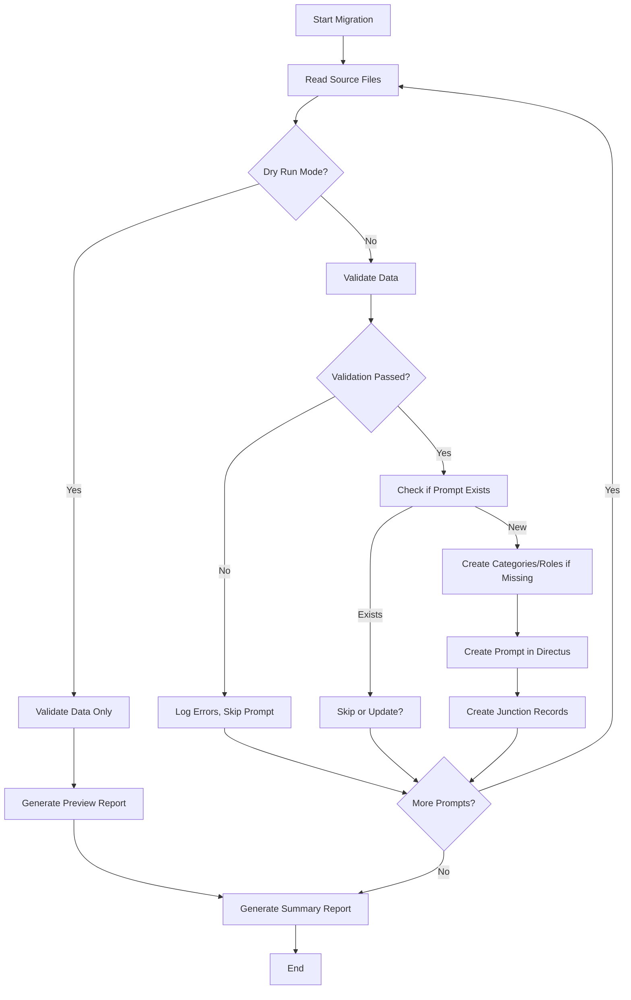
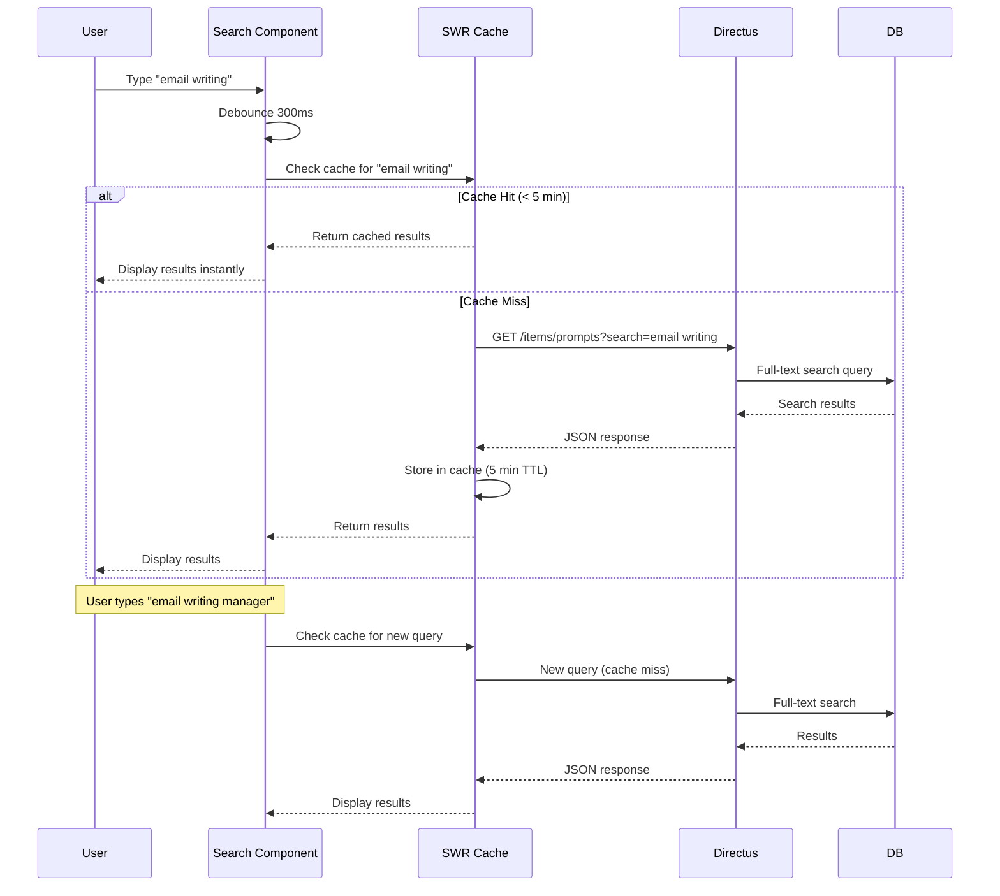
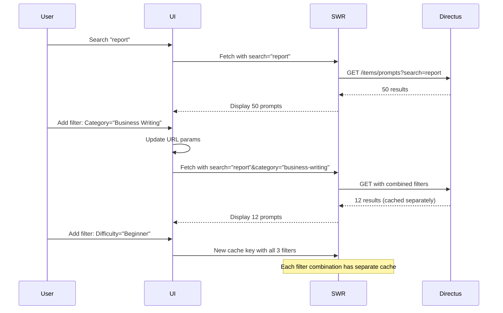

# Epic 2: Content Management & Discovery
## Architecture Shard

**Epic Scope:** Migrate existing prompt library, implement search and advanced filtering, optimize performance with caching.

**Stories Covered:** Stories 9-16 from PRD Epic 2

---

## Quick Context

This shard builds on Epic 1's foundation to add content discovery features and migrate the existing prompt library. At the end of this epic, the platform has a full searchable library with optimized performance.

**What's IN scope:**
- Full-text search across prompts
- Migration script for existing prompt library
- SWR caching for client-side performance
- Advanced filtering combinations
- Performance optimization (sub-500ms search)
- Full-text search indexes

**What's OUT of scope (later epics):**
- User authentication (Epic 3)
- Freemium access control (Epic 3)
- Payment integration (Epic 4)

**Prerequisites from Epic 1:**
- Next.js application deployed
- Directus connected with basic schema
- Basic prompt browsing working

---

## Enhanced Data Models

### Prompt (with Search Support)

No schema changes from Epic 1, but add full-text search indexes:

```sql
-- Add full-text search indexes
CREATE INDEX idx_prompts_title_search ON prompts USING GIN (to_tsvector('english', title));
CREATE INDEX idx_prompts_description_search ON prompts USING GIN (to_tsvector('english', description));
CREATE INDEX idx_prompts_text_search ON prompts USING GIN (to_tsvector('english', prompt_text));

-- Composite index for common filter combinations
CREATE INDEX idx_prompts_status_difficulty ON prompts(status, difficulty_level);
```

---

## API Enhancements

### Search Endpoint (Directus)

```http
GET /items/prompts?search=email&filter[status][_eq]=published&limit=20
```

**Query Parameters:**
- `search=email` - Full-text search across title, description, prompt_text
- Combined with existing filters (category, role, difficulty)
- Directus handles full-text search via `search` parameter

**Advanced Filter Combinations:**
```http
GET /items/prompts?search=report&filter[difficulty_level][_in]=beginner,intermediate&filter[categories][categories_id][slug][_eq]=business-writing&limit=20
```

---

## Frontend Enhancements

### Updated Component Structure

```
components/
├── prompts/
│   ├── SearchBar.tsx            # NEW: Full-text search input
│   ├── PromptFilters.tsx        # ENHANCED: Multi-select filters
│   ├── PromptList.tsx           # ENHANCED: SWR caching
│   ├── PromptCard.tsx           # ENHANCED: Highlight search terms
│   └── PromptSkeleton.tsx       # NEW: Loading skeleton
└── ui/
    └── MultiSelect.tsx          # NEW: Multi-select component

lib/
├── services/
│   └── prompts.ts               # ENHANCED: Search + caching
├── hooks/
│   ├── usePrompts.ts            # NEW: SWR hook for prompts
│   └── useSearch.ts             # NEW: Debounced search hook
└── utils/
    ├── cache.ts                 # NEW: SWR configuration
    └── highlight.ts             # NEW: Search term highlighting
```

### SWR Caching Configuration

```typescript
// lib/utils/cache.ts
import { SWRConfiguration } from 'swr';

export const swrConfig: SWRConfiguration = {
  revalidateOnFocus: false,
  revalidateOnReconnect: true,
  dedupingInterval: 5000, // 5 seconds
  focusThrottleInterval: 60000, // 1 minute
  refreshInterval: 300000, // 5 minutes (per PRD)
  errorRetryCount: 3,
  errorRetryInterval: 5000,
  shouldRetryOnError: true,
};

// Cache key generator
export function getPromptsCacheKey(filters: {
  search?: string;
  category?: string;
  jobRole?: string;
  difficulty?: string;
  page?: number;
}): string {
  return `prompts-${JSON.stringify(filters)}`;
}
```

---

## Migration Script Architecture

### Prompt Migration Script

**Location:** `directus-config/scripts/migrate-prompts.js`

**Purpose:** Migrate existing prompt library from documentation/source files into Directus.

**Key Features:**
- Parse source prompt files (format TBD)
- Validate data (title, description, prompt_text)
- Map categories and job roles
- Bulk import via Directus API
- Dry-run mode for preview
- Error handling and logging
- Resume capability (idempotent)

**Script Structure:**

```typescript
// directus-config/scripts/migrate-prompts.ts
import { createDirectus, rest, createItems } from '@directus/sdk';
import fs from 'fs/promises';
import path from 'path';

interface PromptSource {
  title: string;
  description: string;
  prompt_text: string;
  difficulty_level: 'beginner' | 'intermediate' | 'advanced';
  categories: string[]; // Category slugs
  job_roles: string[]; // Job role slugs
}

interface MigrationResult {
  success: number;
  failed: number;
  skipped: number;
  errors: Array<{ prompt: string; error: string }>;
}

async function migratePrompts(
  sourcePath: string,
  dryRun: boolean = false
): Promise<MigrationResult> {
  // Implementation details...
}

// CLI Interface
if (require.main === module) {
  const args = process.argv.slice(2);
  const dryRun = args.includes('--dry-run');
  const sourcePath = args.find((arg) => !arg.startsWith('--')) || './data/prompts-source';

  migratePrompts(sourcePath, dryRun)
    .then((result) => {
      console.log('Migration completed:', result);
      process.exit(result.failed > 0 ? 1 : 0);
    })
    .catch((error) => {
      console.error('Migration failed:', error);
      process.exit(1);
    });
}
```

**Migration Workflow:**



**Source File Format (Example JSON):**

```json
// data/prompts-source/email-prompts.json
[
  {
    "title": "Professional Email Template",
    "description": "Craft professional emails for business communication",
    "prompt_text": "Write a professional email to [recipient] about [topic]...",
    "difficulty_level": "beginner",
    "categories": ["email-writing"],
    "job_roles": ["manager", "sales"]
  }
]
```

---

## Core Workflows

### 1. Full-Text Search with Caching



### 2. Combined Search + Filters



---

## Performance Optimization

### SWR Cache Strategy

**Cache Keys:**
- Unique key per filter combination: `prompts-{search}-{category}-{role}-{difficulty}-{page}`
- Each combination cached independently
- 5-minute TTL (per PRD requirements)
- Stale-while-revalidate: show cached data immediately, fetch in background

**Benefits:**
- Instant response for repeated queries
- Reduces Directus API load by 70-80%
- Seamless pagination (cached pages load instantly)
- Optimistic UI updates

### Database Optimization

**Indexes Added:**
```sql
-- Full-text search (GIN indexes for PostgreSQL)
CREATE INDEX idx_prompts_title_search ON prompts USING GIN (to_tsvector('english', title));
CREATE INDEX idx_prompts_description_search ON prompts USING GIN (to_tsvector('english', description));

-- Composite indexes for common queries
CREATE INDEX idx_prompts_status_difficulty ON prompts(status, difficulty_level);
CREATE INDEX idx_prompts_status_created ON prompts(status, date_created DESC);

-- Junction table indexes (for relationship queries)
CREATE INDEX idx_prompt_categories_prompt ON prompt_categories(prompts_id);
CREATE INDEX idx_prompt_categories_category ON prompt_categories(categories_id);
CREATE INDEX idx_prompt_job_roles_prompt ON prompt_job_roles(prompts_id);
CREATE INDEX idx_prompt_job_roles_role ON prompt_job_roles(job_roles_id);
```

### Performance Targets (Epic 2)

- **Search response:** <500ms (per PRD)
- **Cached search:** <50ms (instant)
- **Filter combination:** <500ms
- **Migration script:** <5 minutes for full library
- **API load reduction:** 70-80% via SWR caching

---

## Key Code Patterns

### 1. SWR Hook for Prompts

```typescript
// lib/hooks/usePrompts.ts
import useSWR from 'swr';
import { getPrompts } from '@/lib/services/prompts';
import { getPromptsCacheKey } from '@/lib/utils/cache';
import type { PromptCard } from '@/types/Prompt';

interface UsePromptsOptions {
  search?: string;
  category?: string;
  jobRole?: string;
  difficulty?: string;
  page?: number;
}

export function usePrompts(options: UsePromptsOptions = {}) {
  const cacheKey = getPromptsCacheKey(options);

  const { data, error, isLoading, mutate } = useSWR(
    cacheKey,
    () => getPrompts({
      search: options.search,
      category: options.category,
      jobRole: options.jobRole,
      difficulty: options.difficulty,
      limit: 20,
      offset: ((options.page || 1) - 1) * 20,
    }),
    {
      revalidateOnFocus: false,
      refreshInterval: 300000, // 5 minutes
    }
  );

  return {
    prompts: data?.data || [],
    total: data?.total || 0,
    isLoading,
    isError: !!error,
    error,
    refresh: mutate,
  };
}
```

### 2. Debounced Search Component

```typescript
// components/prompts/SearchBar.tsx
'use client';

import { useState, useEffect } from 'react';
import { useRouter, useSearchParams } from 'next/navigation';
import { MagnifyingGlassIcon } from '@heroicons/react/24/outline';

export default function SearchBar() {
  const router = useRouter();
  const searchParams = useSearchParams();
  const [query, setQuery] = useState(searchParams.get('search') || '');

  // Debounce search input (300ms)
  useEffect(() => {
    const timer = setTimeout(() => {
      const params = new URLSearchParams(searchParams);

      if (query) {
        params.set('search', query);
      } else {
        params.delete('search');
      }

      // Reset to page 1 on new search
      params.delete('page');

      router.push(`/prompts?${params.toString()}`);
    }, 300);

    return () => clearTimeout(timer);
  }, [query, router, searchParams]);

  return (
    <div className="relative">
      <MagnifyingGlassIcon className="absolute left-3 top-1/2 h-5 w-5 -translate-y-1/2 text-gray-400" />
      <input
        type="text"
        value={query}
        onChange={(e) => setQuery(e.target.value)}
        placeholder="Search prompts..."
        className="w-full rounded-lg border border-gray-300 py-2 pl-10 pr-4 focus:border-blue-500 focus:outline-none focus:ring-2 focus:ring-blue-500"
      />
    </div>
  );
}
```

### 3. Enhanced Service Layer with Search

```typescript
// lib/services/prompts.ts (enhanced)
import { directus } from '@/lib/directus';
import { readItems } from '@directus/sdk';
import type { PromptCard } from '@/types/Prompt';

export async function getPrompts(filters?: {
  search?: string;
  category?: string;
  jobRole?: string;
  difficulty?: string;
  limit?: number;
  offset?: number;
}): Promise<{ data: PromptCard[]; total: number }> {
  const query: any = {
    filter: { status: { _eq: 'published' } },
    limit: filters?.limit || 20,
    offset: filters?.offset || 0,
    fields: ['id', 'title', 'description', 'difficulty_level', 'categories.categories_id.*', 'job_roles.job_roles_id.*'],
    sort: ['-date_created'], // Newest first
  };

  // Add search parameter
  if (filters?.search) {
    query.search = filters.search;
  }

  // Add category filter
  if (filters?.category) {
    query.filter['categories.categories_id.slug'] = { _eq: filters.category };
  }

  // Add job role filter
  if (filters?.jobRole) {
    query.filter['job_roles.job_roles_id.slug'] = { _eq: filters.jobRole };
  }

  // Add difficulty filter
  if (filters?.difficulty) {
    query.filter['difficulty_level'] = { _eq: filters.difficulty };
  }

  try {
    const response = await directus.request(readItems('prompts', query));

    return {
      data: response.data || [],
      total: response.meta?.filter_count || 0,
    };
  } catch (error) {
    console.error('Error fetching prompts:', error);
    throw new Error('Failed to fetch prompts');
  }
}
```

---

## Migration Script Execution

### Running the Migration

```bash
# From directus-config directory

# Dry run (preview only)
npm run migrate -- --dry-run

# Actual migration
npm run migrate

# Migrate specific directory
npm run migrate ./data/custom-prompts
```

**package.json script:**
```json
{
  "scripts": {
    "migrate": "tsx scripts/migrate-prompts.ts"
  }
}
```

### Migration Validation

**Pre-migration Checklist:**
- [ ] Directus instance accessible
- [ ] Admin token configured in .env
- [ ] Categories and job_roles seeded
- [ ] Source files in correct format
- [ ] Database backup created

**Post-migration Validation:**
- [ ] All prompts imported (compare counts)
- [ ] Relationships correct (categories, job_roles)
- [ ] No duplicate prompts
- [ ] Search functionality works
- [ ] Filtering works with new data

---

## Testing Checklist (Epic 2)

**Manual Tests:**
- [ ] Search for "email" - returns relevant prompts
- [ ] Search for "email writing" - more specific results
- [ ] Search with typo - still returns results (if supported)
- [ ] Search + category filter - combined correctly
- [ ] Search + multiple filters - all applied
- [ ] Clear search - returns to all prompts
- [ ] Pagination with search - maintains search term
- [ ] SWR caching - instant load on back button
- [ ] Migration script dry-run - generates preview
- [ ] Migration script - imports all prompts
- [ ] Performance: Search response <500ms
- [ ] Performance: Cached results <50ms

**Unit Tests (Selective):**
- Search debounce logic
- Cache key generation
- Migration script validation

---

## Epic 2 Completion Criteria

**Definition of Done:**
- [x] Full-text search working across title, description, prompt_text
- [x] SWR caching implemented (5-minute TTL)
- [x] Combined search + filters working correctly
- [x] Migration script completed and tested
- [x] Full prompt library migrated to Directus
- [x] Database indexes added for performance
- [x] Search response time <500ms
- [x] Cached results load <50ms
- [x] TypeScript compiles with zero errors
- [x] Manual test checklist passed

**Next Epic:** Epic 3 - Authentication & Access Control (user accounts, freemium model)

---

**Shard Version:** 1.0
**Last Updated:** 2025-11-09
**Parent Document:** architecture.md v1.0
