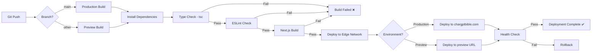

# Shared Infrastructure & Cross-Cutting Concerns
## Architecture Shard

**Purpose:** This shard documents infrastructure, tooling, standards, and cross-cutting concerns that apply across all epics.

---

## Development Environment Setup

### Prerequisites

**Required Software:**
- **Node.js:** 20.x LTS (check: `node --version`)
- **npm:** 10.x or higher (check: `npm --version`)
- **Git:** Latest stable (check: `git --version`)
- **VS Code:** Recommended IDE with extensions

**Recommended VS Code Extensions:**
- ESLint
- Prettier - Code formatter
- Tailwind CSS IntelliSense
- TypeScript Vue Plugin (Volar)
- Error Lens
- GitLens

### Initial Project Setup

```bash
# Clone repository
git clone https://github.com/your-org/chargpt-bible-frontend.git
cd chargpt-bible-frontend

# Install dependencies
npm install

# Copy environment template
cp .env.local.example .env.local

# Edit .env.local with your credentials
# (Directus URL, Stripe keys, etc.)

# Start development server
npm run dev

# Open browser to http://localhost:3000
```

---

## Project Configuration Files

### TypeScript Configuration

```jsonc
// tsconfig.json
{
  "compilerOptions": {
    // Strict type checking
    "strict": true,
    "noImplicitAny": true,
    "strictNullChecks": true,
    "strictFunctionTypes": true,
    "noUnusedLocals": true,
    "noUnusedParameters": true,
    "noImplicitReturns": true,
    "noFallthroughCasesInSwitch": true,

    // Module resolution
    "target": "ES2022",
    "lib": ["ES2022", "DOM", "DOM.Iterable"],
    "module": "ESNext",
    "moduleResolution": "bundler",
    "resolveJsonModule": true,
    "esModuleInterop": true,

    // Next.js specific
    "jsx": "preserve",
    "incremental": true,
    "plugins": [{ "name": "next" }],

    // Path aliases
    "baseUrl": ".",
    "paths": {
      "@/*": ["./*"]
    },

    // Output
    "skipLibCheck": true,
    "forceConsistentCasingInFileNames": true
  },
  "include": ["next-env.d.ts", "**/*.ts", "**/*.tsx", ".next/types/**/*.ts"],
  "exclude": ["node_modules"]
}
```

### Next.js Configuration

```javascript
// next.config.js
/** @type {import('next').NextConfig} */
const nextConfig = {
  // Enable React strict mode
  reactStrictMode: true,

  // Image optimization
  images: {
    domains: ['your-directus-instance.directus.app'],
    formats: ['image/webp', 'image/avif'],
  },

  // Environment variables validation
  env: {
    NEXT_PUBLIC_DIRECTUS_URL: process.env.NEXT_PUBLIC_DIRECTUS_URL,
    NEXT_PUBLIC_STRIPE_PUBLISHABLE_KEY: process.env.NEXT_PUBLIC_STRIPE_PUBLISHABLE_KEY,
    NEXT_PUBLIC_BASE_URL: process.env.NEXT_PUBLIC_BASE_URL,
  },

  // Headers for security
  async headers() {
    return [
      {
        source: '/(.*)',
        headers: [
          {
            key: 'X-Frame-Options',
            value: 'DENY',
          },
          {
            key: 'X-Content-Type-Options',
            value: 'nosniff',
          },
          {
            key: 'Referrer-Policy',
            value: 'strict-origin-when-cross-origin',
          },
        ],
      },
    ];
  },

  // Redirects (if needed)
  async redirects() {
    return [
      {
        source: '/home',
        destination: '/',
        permanent: true,
      },
    ];
  },
};

module.exports = nextConfig;
```

### ESLint Configuration

```json
// .eslintrc.json
{
  "extends": [
    "next/core-web-vitals",
    "plugin:@typescript-eslint/recommended",
    "prettier"
  ],
  "rules": {
    "@typescript-eslint/no-explicit-any": "error",
    "@typescript-eslint/explicit-function-return-type": "warn",
    "@typescript-eslint/no-unused-vars": ["error", { "argsIgnorePattern": "^_" }],
    "no-console": ["warn", { "allow": ["warn", "error"] }]
  }
}
```

### Prettier Configuration

```json
// .prettierrc
{
  "semi": true,
  "trailingComma": "es5",
  "singleQuote": true,
  "printWidth": 100,
  "tabWidth": 2,
  "useTabs": false,
  "arrowParens": "always",
  "endOfLine": "lf"
}
```

### Tailwind Configuration

```javascript
// tailwind.config.js
/** @type {import('tailwindcss').Config} */
module.exports = {
  content: [
    './app/**/*.{js,ts,jsx,tsx,mdx}',
    './components/**/*.{js,ts,jsx,tsx,mdx}',
  ],
  theme: {
    extend: {
      colors: {
        primary: {
          50: '#eff6ff',
          500: '#3b82f6',
          700: '#1d4ed8',
        },
      },
      screens: {
        xs: '360px',
        sm: '640px',
        md: '768px',
        lg: '1024px',
        xl: '1440px',
      },
    },
  },
  plugins: [
    require('@tailwindcss/forms'),
    require('@tailwindcss/typography'),
  ],
};
```

---

## Deployment Architecture

### Vercel Deployment

**Platform:** Vercel (Hobby tier for MVP, Pro for production)

**Deployment Triggers:**
- **Production:** Push to `main` branch
- **Preview:** Any PR or branch push
- **Manual:** Via Vercel CLI or Dashboard

**Build Configuration:**
```json
// package.json scripts
{
  "scripts": {
    "dev": "next dev",
    "build": "next build",
    "start": "next start",
    "lint": "next lint",
    "type-check": "tsc --noEmit",
    "test": "vitest run",
    "test:watch": "vitest"
  }
}
```

**Vercel Project Settings:**
- **Framework Preset:** Next.js
- **Build Command:** `npm run build`
- **Output Directory:** `.next`
- **Install Command:** `npm install`
- **Development Command:** `npm run dev`

### Environment Management

| Environment | Branch | URL Pattern | Purpose |
|-------------|--------|-------------|---------|
| **Development** | Local | `http://localhost:3000` | Local development |
| **Preview** | Any branch | `https://chargpt-bible-{branch}-{hash}.vercel.app` | Feature testing, PR previews |
| **Production** | `main` | `https://chargpt-bible.vercel.app` → Custom domain | Live application |

**Environment Variables (Vercel Dashboard):**

```
# Production Environment
NEXT_PUBLIC_DIRECTUS_URL=https://prod.directus.app
DIRECTUS_URL=https://prod.directus.app
DIRECTUS_ADMIN_TOKEN=***
NEXT_PUBLIC_STRIPE_PUBLISHABLE_KEY=pk_live_***
STRIPE_SECRET_KEY=sk_live_***
STRIPE_WEBHOOK_SECRET=whsec_***
STRIPE_PRICE_ID=price_live_***
NEXT_PUBLIC_BASE_URL=https://chargptbible.com
FREE_PROMPT_LIMIT=3

# Preview Environment
NEXT_PUBLIC_DIRECTUS_URL=https://staging.directus.app
DIRECTUS_URL=https://staging.directus.app
DIRECTUS_ADMIN_TOKEN=***
NEXT_PUBLIC_STRIPE_PUBLISHABLE_KEY=pk_test_***
STRIPE_SECRET_KEY=sk_test_***
STRIPE_WEBHOOK_SECRET=whsec_test_***
STRIPE_PRICE_ID=price_test_***
NEXT_PUBLIC_BASE_URL=https://preview.vercel.app
FREE_PROMPT_LIMIT=3
```

### Directus Deployment

**Platform:** Directus Cloud (Professional tier) or Railway ($7-10/mo)

**Configuration:**
- **Region:** US East (AWS)
- **Database:** PostgreSQL 14+ (managed)
- **Storage:** Local filesystem (MVP) or S3 (production)
- **Admin UI:** `https://your-instance.directus.app/admin`

**Backups:**
- **Automatic:** Daily snapshots (Directus Cloud)
- **Manual:** Export schema via Directus CLI before major changes

---

## CI/CD Pipeline

### Vercel Git Integration (Automatic)



**Build Time Targets:**
- **Type Check:** <30 seconds
- **Lint Check:** <15 seconds
- **Next.js Build:** <2 minutes
- **Total Build Time:** <3 minutes

**Deployment Time:**
- **Edge Propagation:** <30 seconds
- **DNS Update (first deploy):** <5 minutes
- **Total Deployment:** <1 minute after build

---

## Monitoring & Observability

### Vercel Analytics (Built-in)

**Core Web Vitals:**
- **LCP (Largest Contentful Paint):** <2.5s (target)
- **FID (First Input Delay):** <100ms (target)
- **CLS (Cumulative Layout Shift):** <0.1 (target)

**Function Performance:**
- API route execution time
- Cold start frequency
- Error rate

**Access via:** Vercel Dashboard → Analytics

### Directus Logging

**Built-in Logs:**
- API request logs (all endpoints)
- Authentication attempts
- Permission denials
- Error stack traces

**Access via:** Directus Admin UI → Logs

### Error Tracking (Post-MVP)

**Recommended:** Sentry (free tier: 5k events/month)

```typescript
// lib/sentry.ts
import * as Sentry from '@sentry/nextjs';

Sentry.init({
  dsn: process.env.NEXT_PUBLIC_SENTRY_DSN,
  environment: process.env.NODE_ENV,
  tracesSampleRate: 0.1, // 10% of transactions
  beforeSend(event, hint) {
    // Filter out sensitive data
    if (event.request?.headers) {
      delete event.request.headers['Authorization'];
      delete event.request.headers['Cookie'];
    }
    return event;
  },
});
```

### Performance Monitoring

**Lighthouse CI (Manual MVP, Automated Post-MVP):**
```bash
# Run Lighthouse locally
npm install -g lighthouse
lighthouse http://localhost:3000 --view

# Target Scores (MVP):
# Performance: 90+
# Accessibility: 90+
# Best Practices: 90+
# SEO: 90+
```

---

## Security Standards

### Authentication & Authorization

**JWT Token Security:**
- httpOnly cookies (XSS immune)
- Secure flag in production (HTTPS only)
- SameSite=Lax (CSRF protection)
- Short expiry (15 min access, 7 day refresh)

**Password Security:**
- Minimum 8 characters
- Require: uppercase, lowercase, numeric
- Hashed with bcrypt (Directus default)
- No password in logs or error messages

**Session Security:**
- No localStorage/sessionStorage for tokens
- Automatic token refresh (middleware)
- Logout invalidates refresh token

### API Security

**Input Validation:**
- All inputs validated with Zod schemas
- Server-side validation (never trust client)
- Sanitization handled by Directus ORM

**Rate Limiting:**
- Directus: 100 requests/minute per IP (default)
- Custom API routes: Implement middleware (post-MVP)

**CORS Configuration:**
```typescript
// Only allow requests from own domain
const allowedOrigins = [
  process.env.NEXT_PUBLIC_BASE_URL,
  'http://localhost:3000', // Development
];
```

### Webhook Security

**Stripe Webhooks:**
- ALWAYS verify signature
- Use `STRIPE_WEBHOOK_SECRET`
- Reject invalid signatures with 400

**Example:**
```typescript
const signature = request.headers.get('stripe-signature');
const event = stripe.webhooks.constructEvent(body, signature, WEBHOOK_SECRET);
```

### Environment Variable Security

**NEVER commit to Git:**
```
# .gitignore
.env.local
.env.*.local
.env.production
```

**Use Vercel Environment Variables:**
- Encrypted at rest
- Scoped by environment (production, preview, development)
- Accessible only to build process and serverless functions

---

## Coding Standards

### File Naming Conventions

| Type | Convention | Example |
|------|-----------|---------|
| React Components | PascalCase | `UserProfile.tsx`, `PromptCard.tsx` |
| Hooks | camelCase with `use` | `useAuth.ts`, `usePrompts.ts` |
| Utilities | camelCase | `formatDate.ts`, `truncate.ts` |
| API Routes | kebab-case folder | `app/api/checkout/create-session/route.ts` |
| Types/Interfaces | PascalCase | `User.ts`, `Prompt.ts` |
| Constants | SCREAMING_SNAKE_CASE | `FREE_PROMPT_LIMIT`, `MAX_RETRIES` |

### Component Structure

```typescript
// Good component structure
'use client'; // Only if client component

import { useState } from 'react'; // React imports first
import { useRouter } from 'next/navigation'; // Framework imports second
import { Button } from '@/components/ui/Button'; // Local imports third
import type { User } from '@/types/User'; // Type imports last

interface ComponentProps {
  user: User;
  onUpdate: (user: User) => void;
}

export default function Component({ user, onUpdate }: ComponentProps) {
  // State hooks
  const [isLoading, setIsLoading] = useState(false);

  // Router/navigation hooks
  const router = useRouter();

  // Event handlers
  const handleSubmit = async () => {
    // Implementation
  };

  // Render
  return (
    <div>
      {/* JSX */}
    </div>
  );
}
```

### TypeScript Best Practices

**Never use `any`:**
```typescript
// ❌ BAD
function process(data: any) {
  return data.value;
}

// ✅ GOOD
function process(data: unknown): string {
  if (typeof data === 'object' && data !== null && 'value' in data) {
    return String(data.value);
  }
  throw new Error('Invalid data');
}
```

**Explicit return types:**
```typescript
// ❌ BAD
function getUser(id: string) {
  return fetch(`/api/users/${id}`);
}

// ✅ GOOD
async function getUser(id: string): Promise<User | null> {
  const response = await fetch(`/api/users/${id}`);
  if (!response.ok) return null;
  return response.json();
}
```

**Prefer interfaces for objects:**
```typescript
// ✅ GOOD - Interface for object shape
interface User {
  id: string;
  email: string;
}

// ✅ GOOD - Type for unions/primitives
type SubscriptionStatus = 'free' | 'paid';
```

---

## Accessibility Standards

### Target: WCAG 2.1 Level AA Compliance

**Keyboard Navigation:**
- All interactive elements accessible via keyboard
- Logical tab order
- Visible focus indicators
- Skip to main content link

**Color Contrast:**
- Text: 4.5:1 minimum (normal text)
- Large text: 3:1 minimum (18pt+ or 14pt+ bold)
- UI components: 3:1 minimum

**Semantic HTML:**
```tsx
// ✅ GOOD - Semantic HTML
<nav>
  <ul>
    <li><a href="/prompts">Prompts</a></li>
  </ul>
</nav>

<main>
  <h1>Page Title</h1>
  <article>...</article>
</main>

// ❌ BAD - Divs everywhere
<div className="nav">
  <div className="nav-item">
    <div onClick={...}>Prompts</div>
  </div>
</div>
```

**ARIA Labels:**
```tsx
// Icon-only buttons need aria-label
<button aria-label="Copy prompt to clipboard">
  <CopyIcon />
</button>

// Form inputs need labels
<label htmlFor="email">Email</label>
<input id="email" type="email" />
```

**Touch Targets:**
- Minimum 48x48px for mobile
- Adequate spacing between interactive elements

---

## Testing Infrastructure

### Vitest Configuration

```typescript
// vitest.config.ts
import { defineConfig } from 'vitest/config';
import react from '@vitejs/plugin-react';
import path from 'path';

export default defineConfig({
  plugins: [react()],
  test: {
    environment: 'jsdom',
    globals: true,
    setupFiles: './tests/setup.ts',
  },
  resolve: {
    alias: {
      '@': path.resolve(__dirname, './'),
    },
  },
});
```

### Test Organization

```
tests/
├── setup.ts                    # Global test setup
├── unit/
│   ├── utils/
│   │   ├── formatDate.test.ts
│   │   └── access-control.test.ts
│   └── services/
│       └── prompts.test.ts
├── integration/                # Post-MVP
│   └── api/
│       └── webhooks.test.ts
└── e2e/                        # Post-MVP
    └── subscription.spec.ts
```

### Example Unit Test

```typescript
// tests/unit/utils/access-control.test.ts
import { describe, it, expect } from 'vitest';
import { canAccessPrompt } from '@/lib/utils/access-control';
import type { User } from '@/types/User';

describe('canAccessPrompt', () => {
  it('should allow paid users to access any prompt', () => {
    const paidUser: User = {
      id: '1',
      email: 'paid@example.com',
      subscription_status: 'paid',
      // ... other fields
    };

    expect(canAccessPrompt(paidUser, 0)).toBe(true);
    expect(canAccessPrompt(paidUser, 10)).toBe(true);
  });

  it('should allow free users to access first 3 prompts', () => {
    const freeUser: User = {
      id: '2',
      email: 'free@example.com',
      subscription_status: 'free',
      // ... other fields
    };

    expect(canAccessPrompt(freeUser, 0)).toBe(true);
    expect(canAccessPrompt(freeUser, 2)).toBe(true);
    expect(canAccessPrompt(freeUser, 3)).toBe(false);
  });

  it('should deny access to unauthenticated users', () => {
    expect(canAccessPrompt(null, 0)).toBe(false);
  });
});
```

---

## Git Workflow

### Branch Strategy

**Main Branches:**
- `main` - Production-ready code (protected)
- `develop` - Integration branch (optional for team)

**Feature Branches:**
- `feature/epic-1-prompt-display`
- `feature/epic-2-search`
- `bugfix/login-error`
- `hotfix/payment-webhook`

### Commit Message Format

```
type(scope): brief description

Detailed explanation (optional)

- Bullet points for details (optional)

Fixes #issue-number
```

**Types:**
- `feat`: New feature
- `fix`: Bug fix
- `docs`: Documentation changes
- `style`: Code style changes (formatting)
- `refactor`: Code refactoring
- `test`: Test additions/changes
- `chore`: Build process, tooling

**Examples:**
```
feat(auth): add JWT authentication with httpOnly cookies

fix(webhooks): handle duplicate Stripe events with idempotency check

docs(readme): update environment variable setup instructions
```

### Pull Request Template

```markdown
## Description
Brief description of changes

## Type of Change
- [ ] New feature
- [ ] Bug fix
- [ ] Breaking change
- [ ] Documentation update

## Testing
- [ ] Manual testing completed
- [ ] Unit tests added/updated
- [ ] TypeScript compiles without errors
- [ ] ESLint passes

## Screenshots (if applicable)
[Add screenshots for UI changes]

## Checklist
- [ ] Code follows project coding standards
- [ ] Self-review completed
- [ ] Comments added for complex logic
- [ ] Documentation updated
- [ ] No console.log statements (except console.error/warn)
```

---

## Performance Budget

### Bundle Size Targets

| Asset Type | Target | Maximum |
|-----------|--------|---------|
| Initial JS Bundle | <200 KB | 300 KB |
| Total JS (all pages) | <500 KB | 750 KB |
| CSS Bundle | <50 KB | 75 KB |
| Images (per page) | <500 KB | 1 MB |

### Monitoring Bundle Size

```bash
# Analyze bundle after build
npm run build
npx @next/bundle-analyzer
```

### Performance Targets (Recap)

- **Landing Page:** <2s load (static)
- **Prompt Library:** <3s load (SSR)
- **Search Response:** <500ms
- **Cached Results:** <50ms
- **API Routes:** <1s response time

---

## Rollback Strategy

### Instant Rollback (Vercel)

**Steps:**
1. Navigate to Vercel Dashboard → Deployments
2. Find last known good deployment
3. Click "Promote to Production"
4. Instant rollback (<5 seconds, zero downtime)

### Database Rollback (Directus)

**Prevention:**
- Create schema snapshot before major changes: `npx directus schema snapshot`
- Test migrations on staging environment first

**Recovery:**
- Restore from daily backup (Directus Cloud automatic backups)
- Re-apply schema from snapshot: `npx directus schema apply --yes`

---

## Cost Management

### Infrastructure Costs (MVP)

| Service | Tier | Monthly Cost |
|---------|------|--------------|
| Vercel | Hobby | $0 (Pro: $20) |
| Directus Cloud | Professional | $15-20 |
| Stripe | Pay-as-you-go | 2.9% + $0.30/transaction |
| Domain | Namecheap/Cloudflare | $10-15/year |
| **Total** | | **~$20-35/month** |

### Cost Optimization Tips

- Use Vercel Hobby tier for MVP (upgrade to Pro for team collaboration)
- Directus Cloud vs Railway: Railway cheaper ($7/mo) but requires Docker knowledge
- Optimize images (WebP format, lazy loading)
- Minimize client-side JavaScript (Server Components)
- Cache aggressively (SWR 5-minute TTL)

---

## Documentation Standards

### Code Comments

**When to comment:**
- Complex business logic
- Non-obvious workarounds
- Security-critical code
- Performance optimizations

**When NOT to comment:**
- Self-explanatory code
- Obvious operations

```typescript
// ❌ BAD - Obvious comment
// Set loading to true
setIsLoading(true);

// ✅ GOOD - Explains why
// Debounce search to avoid excessive API calls (300ms delay)
const debouncedSearch = debounce(handleSearch, 300);
```

### README Documentation

Each major directory should have a README:
- `components/README.md` - Component organization
- `lib/services/README.md` - Service layer patterns
- `app/api/README.md` - API route documentation

---

## Support & Troubleshooting

### Common Issues

**1. Build fails with TypeScript errors**
- Run `npm run type-check` locally first
- Fix all type errors before pushing
- Check `tsconfig.json` is not modified

**2. Directus API returns 403 Forbidden**
- Verify RBAC permissions in Directus Admin UI
- Check user role assignment
- Confirm API token has correct scope

**3. Stripe webhooks not received**
- Verify webhook endpoint URL in Stripe Dashboard
- Check webhook secret matches `STRIPE_WEBHOOK_SECRET`
- Test locally with Stripe CLI: `stripe listen --forward-to localhost:3000/api/webhooks/stripe`

**4. Vercel deployment succeeds but site broken**
- Check environment variables in Vercel Dashboard
- Verify `NEXT_PUBLIC_*` variables are set
- Check Function Logs in Vercel for runtime errors

---

## Shared Infrastructure Checklist

**Initial Setup:**
- [ ] Node.js 20.x installed
- [ ] Git repository initialized
- [ ] Vercel project created and linked
- [ ] Directus Cloud instance provisioned
- [ ] Environment variables configured (dev, preview, prod)
- [ ] TypeScript strict mode enabled
- [ ] ESLint and Prettier configured
- [ ] Git pre-commit hooks set up (optional)

**Before Each Epic:**
- [ ] Pull latest `main` branch
- [ ] Create feature branch
- [ ] Verify environment variables
- [ ] Run `npm install` to update dependencies

**Before Each Deployment:**
- [ ] Run `npm run type-check` (zero errors)
- [ ] Run `npm run lint` (zero errors)
- [ ] Run `npm run build` (successful)
- [ ] Test critical user flows manually
- [ ] Check Lighthouse scores (90+)

---

**Shard Version:** 1.0
**Last Updated:** 2025-11-09
**Parent Document:** architecture.md v1.0
