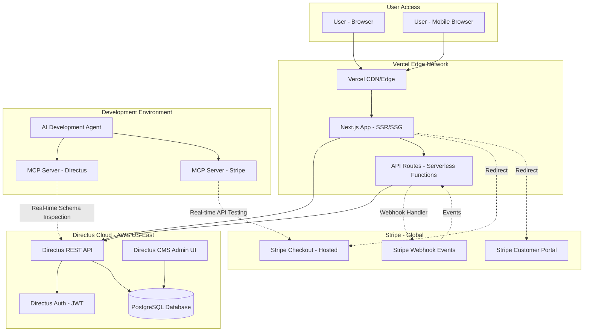

# CharGPT Bible Fullstack Architecture Document

## Introduction

This document outlines the complete fullstack architecture for **CharGPT Bible**, including backend systems, frontend implementation, and their integration. It serves as the single source of truth for AI-driven development, ensuring consistency across the entire technology stack.

This unified approach combines what would traditionally be separate backend and frontend architecture documents, streamlining the development process for modern fullstack applications where these concerns are increasingly intertwined.

### Starter Template or Existing Project

**N/A - Greenfield project with managed services approach**

The project leverages existing platforms (Directus as BaaS, Next.js as framework) but does not use a specific fullstack starter template. Instead, the architecture relies on:
- **Directus Cloud/Railway**: Pre-configured backend-as-a-service eliminating custom backend code
- **Next.js 14+ with App Router**: Modern framework with built-in best practices
- **Vercel deployment**: Zero-config deployment platform

This approach provides the benefits of a starter template (rapid setup, proven patterns) without the constraints of a specific boilerplate.

### Change Log

| Date | Version | Description | Author |
|------|---------|-------------|---------|
| 2025-11-09 | 1.0 | Initial architecture document creation | Winston (Architect) |

---

## High Level Architecture

### Technical Summary

CharGPT Bible employs a **Serverless-Adjacent Monolith** architecture built on managed services to achieve rapid MVP delivery within 2 weeks. The frontend is a Next.js 14+ application with App Router deployed to Vercel as serverless functions, providing static generation for marketing pages and server-side rendering for dynamic content. The backend leverages **Directus 10+ as a Backend-as-a-Service (BaaS)**, eliminating the need for custom API development—Directus handles authentication, content management, access control, and REST API exposure automatically. Payment processing is delegated to Stripe Checkout (hosted), with webhooks flowing through Next.js API routes to sync subscription state to Directus. The system integrates tightly via the Directus REST API, with MCP (Model Context Protocol) servers connected to both Directus and Stripe instances during development for AI-assisted configuration and real-time validation. This architecture prioritizes speed-to-market, cost efficiency (<$100/month), and developer productivity through extensive use of managed services.

### Platform and Infrastructure Choice

**Platform:** Vercel + Directus Cloud + Stripe

**Key Services:**
- **Frontend Hosting:** Vercel (serverless functions, edge network, automatic HTTPS)
- **Backend/CMS:** Directus Cloud (managed PostgreSQL, REST API, authentication)
- **Payment Processing:** Stripe (Checkout, Customer Portal, webhooks)
- **Development Tooling:** MCP servers for Directus and Stripe integration

**Deployment Hosts and Regions:**
- **Vercel:** Global edge network with US primary region
- **Directus Cloud:** US East region (AWS-backed)
- **Stripe:** Global with US-based account

### Repository Structure

**Structure:** Polyrepo (Separate Repositories)

**Repository Organization:**

**1. `chargpt-bible-frontend` (Next.js application)**
```
chargpt-bible-frontend/
├── .github/workflows/        # Vercel CI/CD
├── app/                       # Next.js App Router
│   ├── (auth)/               # Auth route group
│   ├── (marketing)/          # Public pages
│   ├── api/                  # API routes (webhooks)
│   └── dashboard/            # Protected routes
├── components/               # React components
├── lib/                      # Utilities, Directus client
├── public/                   # Static assets
├── styles/                   # Global styles
├── types/                    # TypeScript types (mirroring Directus)
├── .env.local.example
└── package.json
```

**2. `directus-config` (Directus schema and migrations)**
```
directus-config/
├── scripts/                  # Migration scripts
│   └── migrate-prompts.js
├── snapshots/               # Directus schema snapshots
│   └── schema.yaml
├── data/                    # Seed data
│   └── prompts-source/
└── README.md                # Admin documentation
```

**Monorepo Tool:** N/A - Separate repositories

**Package Organization:** Shared TypeScript types will be manually synced between repos for MVP. Post-MVP consideration: publish shared types as npm package if complexity grows.

### High Level Architecture Diagram



### Architectural Patterns

- **Jamstack Architecture:** Static generation for landing/marketing pages with serverless API routes for dynamic operations - _Rationale:_ Optimal performance (sub-3s load times), excellent SEO, and automatic CDN distribution via Vercel. Aligns with NFR1 performance targets.

- **Backend-as-a-Service (BaaS) Pattern:** Directus handles 90% of backend concerns (auth, CRUD, access control) - _Rationale:_ Eliminates weeks of custom backend development. The 2-week timeline is only achievable by avoiding custom API code. Directus provides production-grade auth and REST API out-of-box.

- **Serverless Functions for Integration:** Next.js API routes handle Stripe webhooks and Directus API orchestration - _Rationale:_ Minimal custom backend code isolated to integration points. Automatic scaling and zero infrastructure management via Vercel.

- **Component-Based UI:** Reusable React components with TypeScript - _Rationale:_ Maintainability and type safety. Next.js App Router encourages Server Components by default, reducing client-side JavaScript.

- **Repository Pattern (via Directus SDK):** Directus SDK abstracts data access - _Rationale:_ All database queries go through Directus REST API using SDK, providing consistent error handling and authentication. No raw SQL in frontend code.

- **Webhook-Driven Eventual Consistency:** Stripe events update Directus user records asynchronously - _Rationale:_ Decouples payment processing from user management. Stripe webhooks are reliable (with retries), and Next.js API route ensures idempotent processing.

- **Freemium Access Control via API Filtering:** Free vs paid access enforced at Directus API level using role-based permissions - _Rationale:_ Security in-depth: access control at data layer prevents client-side bypass. Directus RBAC is battle-tested.

---

## Tech Stack

### Technology Stack Table

| Category | Technology | Version | Purpose | Rationale |
|----------|-----------|---------|---------|-----------|
| **Frontend Language** | TypeScript | 5.3+ | Type-safe frontend development | Prevents runtime errors, excellent IDE support, essential for scaling to multiple developers. Strict mode enforced per PRD. |
| **Frontend Framework** | Next.js | 14.2+ | React framework with App Router | Modern RSC architecture, built-in routing, API routes for webhooks, automatic code splitting, Vercel-optimized deployment. App Router required for latest features. |
| **UI Component Library** | Headless UI + Radix UI | Headless UI 2.0+, Radix UI 1.0+ | Accessible unstyled components | WCAG AA compliance built-in, works perfectly with Tailwind, no design constraints, tree-shakeable. |
| **State Management** | React Context + SWR | SWR 2.2+ | Client state and server cache | Context for auth/user session, SWR for Directus API caching (5-min TTL per PRD), eliminates need for Redux/Zustand complexity. |
| **Backend Language** | TypeScript (Node.js) | TypeScript 5.3+, Node 20 LTS | API routes and scripts | Shared types with frontend, webhook handlers, migration scripts. Minimal backend code due to Directus. |
| **Backend Framework** | Directus | 10.10+ | Headless CMS and BaaS | Eliminates custom backend code. Provides REST API, auth (JWT), RBAC, admin UI, PostgreSQL ORM out-of-box. Critical for 2-week timeline. |
| **API Style** | REST (Directus REST API) | Directus REST API v10 | Frontend-backend communication | Directus native REST API is production-ready, well-documented, includes filtering/pagination/auth. Simpler than GraphQL for MVP. |
| **Database** | PostgreSQL | 14+ | Primary data store | Industry-standard relational DB, included with Directus Cloud, supports complex relationships (Many-to-Many for prompts), ACID compliance. |
| **Cache** | SWR (Client-side) | 2.2+ | API response caching | Built-in stale-while-revalidate caching, reduces Directus API load, optimistic UI updates, integrates with React Suspense. |
| **File Storage** | Directus Assets (Local/S3) | Included with Directus | Future file uploads | Not needed for MVP (no user uploads), but Directus includes asset management for future prompt attachments or images. |
| **Authentication** | Directus Auth (JWT) | Included with Directus | User registration and login | Built-in JWT-based auth with refresh tokens, httpOnly cookie storage, RBAC (Free vs Paid roles), eliminates need for custom auth. |
| **Frontend Testing** | Vitest | 1.0+ | Unit tests for utilities | Fast Vite-powered test runner, Jest-compatible API, minimal setup for MVP unit tests (webhook signature verification, formatting utils). |
| **Backend Testing** | Vitest + Supertest | Vitest 1.0+, Supertest 6.3+ | API route testing | Test Next.js API routes (Stripe webhooks), Supertest for HTTP assertions, but MVP relies on manual testing per PRD. |
| **E2E Testing** | Playwright | 1.40+ (Post-MVP) | End-to-end user flows | Deferred to post-MVP per PRD. Playwright chosen for cross-browser support (Chrome, Firefox, Safari) and mobile emulation. |
| **Build Tool** | Vercel CLI + Turbopack | Latest | Next.js builds | Vercel CLI for local preview, Turbopack (Next.js 14 default) for fast dev server, automatic production optimization. |
| **Bundler** | Turbopack / Webpack 5 | Next.js built-in | JavaScript bundling | Turbopack in dev mode (faster HMR), Webpack 5 for production builds (mature, optimized). Next.js handles config automatically. |
| **IaC Tool** | N/A (Managed Services) | - | Infrastructure | Vercel and Directus Cloud are fully managed—no Terraform/CloudFormation needed. Infrastructure is "code" via dashboard config. |
| **CI/CD** | Vercel Git Integration | Built-in | Automated deployments | Git push to main → automatic deployment, preview URLs for PRs, environment variables managed via dashboard. Zero CI/CD config needed. |
| **Monitoring** | Vercel Analytics + Directus Logs | Built-in | Performance and errors | Vercel provides Core Web Vitals tracking, Directus logs API errors. Post-MVP: add Sentry for error tracking. |
| **Logging** | Console + Vercel Logs | Built-in | Application logs | Console.log for development, Vercel captures all function logs, Directus has built-in request logging. Structured logging post-MVP. |
| **CSS Framework** | Tailwind CSS | 3.4+ | Utility-first styling | Rapid UI development, mobile-responsive by default (breakpoints: 640px, 768px, 1024px, 1440px), purges unused CSS, excellent with Next.js. |
| **Form Handling** | React Hook Form + Zod | RHF 7.50+, Zod 3.22+ | Forms and validation | Minimal re-renders, excellent TypeScript integration, Zod schema for both client and API validation (shared validation logic). |
| **HTTP Client** | Directus SDK + Fetch API | @directus/sdk 16.0+ | API requests | Directus SDK handles auth/refresh tokens automatically, native Fetch API for Stripe (no Axios needed), reduces bundle size. |
| **Payment Processing** | Stripe | Stripe API 2024-11-20+ | Subscriptions and checkout | Hosted Checkout (PCI compliance), Customer Portal, reliable webhooks with retry, Node SDK for webhook signature verification. |
| **Copy-to-Clipboard** | Navigator Clipboard API | Browser built-in | Prompt copying | Native browser API (no library needed), async/await support, falls back gracefully on older browsers. |
| **Development Tooling** | MCP Servers (Directus + Stripe) | Latest | AI-assisted development | Real-time schema inspection (Directus), webhook testing (Stripe), accelerates Epic 1, 2, and 4 per PRD. Critical for 2-week timeline. |
| **Code Quality** | ESLint + Prettier | ESLint 8.56+, Prettier 3.2+ | Code linting and formatting | Next.js includes ESLint config, Prettier for consistent formatting, pre-commit hooks via Husky (optional for MVP). |
| **Environment Variables** | .env.local + Vercel Env Vars | Built-in | Configuration management | Next.js native env var support, `.env.local` for dev (gitignored), Vercel dashboard for production secrets. |

---

## Data Models

This section defines the conceptual data models and TypeScript interfaces that form the foundation of the application.

### User

**Purpose:** Extended Directus user model with subscription management fields. Handles authentication, authorization, and subscription state tracking.

**Key Attributes:**
- `id`: UUID (auto-generated) - Primary key
- `email`: string (unique, required) - User email for login and communication
- `password`: string (hashed) - Authentication credential (never exposed to frontend)
- `subscription_status`: enum ('free', 'paid') - Determines access level (default: 'free')
- `stripe_customer_id`: string (nullable) - Links user to Stripe customer record
- `stripe_subscription_id`: string (nullable) - Current active Stripe subscription
- `subscription_expires_at`: datetime (nullable) - Subscription renewal/expiry date
- `date_created`: datetime (auto) - Account creation timestamp
- `date_updated`: datetime (auto) - Last modification timestamp
- `status`: enum ('active', 'suspended', 'archived') - Account status (Directus built-in)

#### TypeScript Interface

```typescript
// types/User.ts
export type SubscriptionStatus = 'free' | 'paid';
export type UserStatus = 'active' | 'suspended' | 'archived';

export interface User {
  id: string;
  email: string;
  subscription_status: SubscriptionStatus;
  stripe_customer_id: string | null;
  stripe_subscription_id: string | null;
  subscription_expires_at: string | null; // ISO 8601 date string
  date_created: string;
  date_updated: string;
  status: UserStatus;
}

// Frontend-safe user (excludes sensitive fields)
export type PublicUser = Omit<User, 'stripe_customer_id' | 'stripe_subscription_id'>;
```

#### Relationships
- One-to-Many: User can have multiple sessions (Directus built-in)
- One-to-One: User links to Stripe Customer (external)

---

### Prompt

**Purpose:** Core content entity representing a single ChatGPT prompt template. Supports categorization, difficulty levels, and full-text search.

**Key Attributes:**
- `id`: UUID (auto-generated) - Primary key
- `title`: string (required, max 200 chars) - Prompt display name
- `description`: text (required, max 500 chars) - Short explanation of prompt purpose
- `prompt_text`: text (required, max 5000 chars) - Full prompt content for copy-paste
- `difficulty_level`: enum ('beginner', 'intermediate', 'advanced') - User experience level
- `status`: enum ('draft', 'published', 'archived') - Publishing workflow state
- `date_created`: datetime (auto) - Creation timestamp
- `date_updated`: datetime (auto) - Last edit timestamp
- `sort`: integer (nullable) - Manual ordering within categories

#### TypeScript Interface

```typescript
// types/Prompt.ts
export type DifficultyLevel = 'beginner' | 'intermediate' | 'advanced';
export type PromptStatus = 'draft' | 'published' | 'archived';

export interface Prompt {
  id: string;
  title: string;
  description: string;
  prompt_text: string;
  difficulty_level: DifficultyLevel;
  status: PromptStatus;
  date_created: string;
  date_updated: string;
  sort: number | null;

  // Relationships (populated via Directus API)
  categories?: Category[]; // Many-to-Many
  job_roles?: JobRole[];   // Many-to-Many
}

// List view (excludes full prompt_text for performance)
export interface PromptCard {
  id: string;
  title: string;
  description: string;
  difficulty_level: DifficultyLevel;
  categories?: Pick<Category, 'id' | 'name' | 'slug'>[];
  job_roles?: Pick<JobRole, 'id' | 'name' | 'slug'>[];
}
```

#### Relationships
- Many-to-Many: Prompt ↔ Categories (via `prompt_categories` junction)
- Many-to-Many: Prompt ↔ Job Roles (via `prompt_job_roles` junction)

---

### Category

**Purpose:** Taxonomy for organizing prompts by task type (e.g., "Email Writing", "Report Creation").

**Key Attributes:**
- `id`: UUID (auto-generated) - Primary key
- `name`: string (required, unique, max 100 chars) - Display name
- `slug`: string (required, unique, max 100 chars) - URL-friendly identifier
- `description`: text (nullable, max 500 chars) - Category explanation
- `sort`: integer (nullable) - Display order

#### TypeScript Interface

```typescript
// types/Category.ts
export interface Category {
  id: string;
  name: string;
  slug: string;
  description: string | null;
  sort: number | null;
}

// With prompt count (for filter UI)
export interface CategoryWithCount extends Category {
  prompt_count: number;
}
```

#### Relationships
- Many-to-Many: Category ↔ Prompts (via `prompt_categories` junction)

---

### JobRole

**Purpose:** Taxonomy for organizing prompts by professional role (e.g., "Manager", "Marketer").

**Key Attributes:**
- `id`: UUID (auto-generated) - Primary key
- `name`: string (required, unique, max 100 chars) - Display name
- `slug`: string (required, unique, max 100 chars) - URL-friendly identifier
- `description`: text (nullable, max 500 chars) - Role explanation
- `sort`: integer (nullable) - Display order

#### TypeScript Interface

```typescript
// types/JobRole.ts
export interface JobRole {
  id: string;
  name: string;
  slug: string;
  description: string | null;
  sort: number | null;
}

// With prompt count (for filter UI)
export interface JobRoleWithCount extends JobRole {
  prompt_count: number;
}
```

#### Relationships
- Many-to-Many: JobRole ↔ Prompts (via `prompt_job_roles` junction)

---

## API Specification

The application uses **Directus REST API** for all content and user management operations, supplemented by **Next.js API routes** for Stripe webhook handling and checkout session creation.

See the complete OpenAPI 3.0 specification in the PRD document for full endpoint details. Key endpoints include:

**Authentication:**
- `POST /auth/login` - User authentication with JWT token issuance
- `POST /auth/refresh` - Token refresh
- `POST /auth/logout` - Session termination

**User Management:**
- `POST /users` - User registration
- `GET /users/me` - Get current authenticated user
- `PATCH /users/{id}` - Update user (webhook handler use)

**Prompts:**
- `GET /items/prompts` - List prompts with filtering, search, pagination
- `GET /items/prompts/{id}` - Get single prompt with relationships

**Taxonomy:**
- `GET /items/categories` - List all categories
- `GET /items/job_roles` - List all job roles

**Stripe Integration (Next.js API Routes):**
- `POST /api/checkout/create-session` - Create Stripe Checkout session
- `POST /api/billing/create-portal-session` - Create Customer Portal session
- `POST /api/webhooks/stripe` - Stripe webhook handler

---

## Components

### Frontend Application (Next.js)

**Responsibility:** User-facing web application providing prompt browsing, authentication, and subscription management.

**Key Interfaces:**
- `/` - Landing page (static)
- `/prompts` - Prompt library with filtering/search (SSR)
- `/prompts/[id]` - Prompt detail page (SSR)
- `/login`, `/signup` - Authentication flows (SSR)
- `/dashboard` - User account management (SSR, protected)
- `/upgrade` - Subscription purchase flow (SSR, protected)
- API routes for Stripe integration

**Dependencies:** Directus REST API, Stripe API, Vercel Edge Network

**Technology Stack:** Next.js 14+, TypeScript 5.3+, Tailwind CSS 3.4+, Directus SDK 16.0+, Stripe Node SDK

---

### Directus Backend (BaaS)

**Responsibility:** Headless CMS and backend-as-a-service providing authentication, content management, REST API, and RBAC.

**Key Interfaces:**
- Authentication endpoints
- User management
- Prompt CRUD and filtering
- Taxonomy management
- Directus admin UI

**Dependencies:** PostgreSQL 14+, Directus Cloud infrastructure

**Technology Stack:** Directus 10.10+, PostgreSQL 14+, JWT authentication, RBAC permissions

---

## External APIs

### Stripe API

- **Purpose:** Handle subscription-based payments, checkout flow, customer billing management
- **Documentation:** https://stripe.com/docs/api
- **Base URL:** `https://api.stripe.com/v1`
- **Authentication:** Secret Key (server-side), Publishable Key (client-side), Webhook Secret
- **Rate Limits:** 100 requests/second (default)

**Key Endpoints Used:**
- `POST /v1/checkout/sessions` - Create Checkout Session
- `POST /v1/billing_portal/sessions` - Create Customer Portal Session
- `GET /v1/subscriptions/:id` - Retrieve Subscription details

**Webhook Events Consumed:**
- `checkout.session.completed` - Payment completed
- `customer.subscription.updated` - Subscription status changed
- `customer.subscription.deleted` - Subscription canceled

---

### Directus Cloud API

- **Purpose:** Managed backend infrastructure providing REST API, authentication, content management
- **Documentation:** https://docs.directus.io/reference/introduction.html
- **Base URL:** `https://your-instance.directus.app`
- **Authentication:** JWT Bearer Token, Static Token (admin), Cookie-based (browser)
- **Rate Limits:** 100 requests/minute per IP (Directus Cloud default)

**Key Endpoints Used:**
- `POST /auth/login`, `/auth/refresh` - Authentication
- `POST /users`, `GET /users/me`, `PATCH /users/:id` - User management
- `GET /items/prompts`, `GET /items/prompts/:id` - Prompt data
- `GET /items/categories`, `GET /items/job_roles` - Taxonomy

---

## Core Workflows

See the PRD and architecture sections above for detailed sequence diagrams covering:
- User Registration and Login
- Browse Prompts (Free User with Access Control)
- Subscription Purchase (Stripe Checkout)
- Stripe Webhook Processing (Subscription Activation)
- Access Full Library (Paid User)
- Manage Subscription (Customer Portal)
- Token Refresh (Automatic)
- Error Handling (Payment Failure)

---

## Database Schema

Complete PostgreSQL schema managed by Directus:

```sql
-- DIRECTUS USERS TABLE (Extended)
ALTER TABLE directus_users
ADD COLUMN IF NOT EXISTS subscription_status VARCHAR(20) DEFAULT 'free';
ADD COLUMN IF NOT EXISTS stripe_customer_id VARCHAR(255);
ADD COLUMN IF NOT EXISTS stripe_subscription_id VARCHAR(255);
ADD COLUMN IF NOT EXISTS subscription_expires_at TIMESTAMP WITH TIME ZONE;

-- CATEGORIES TABLE
CREATE TABLE IF NOT EXISTS categories (
    id UUID PRIMARY KEY DEFAULT gen_random_uuid(),
    name VARCHAR(100) NOT NULL UNIQUE,
    slug VARCHAR(100) NOT NULL UNIQUE,
    description TEXT,
    sort INTEGER,
    date_created TIMESTAMP WITH TIME ZONE DEFAULT CURRENT_TIMESTAMP,
    date_updated TIMESTAMP WITH TIME ZONE DEFAULT CURRENT_TIMESTAMP
);

-- JOB ROLES TABLE
CREATE TABLE IF NOT EXISTS job_roles (
    id UUID PRIMARY KEY DEFAULT gen_random_uuid(),
    name VARCHAR(100) NOT NULL UNIQUE,
    slug VARCHAR(100) NOT NULL UNIQUE,
    description TEXT,
    sort INTEGER,
    date_created TIMESTAMP WITH TIME ZONE DEFAULT CURRENT_TIMESTAMP,
    date_updated TIMESTAMP WITH TIME ZONE DEFAULT CURRENT_TIMESTAMP
);

-- PROMPTS TABLE
CREATE TABLE IF NOT EXISTS prompts (
    id UUID PRIMARY KEY DEFAULT gen_random_uuid(),
    status VARCHAR(20) DEFAULT 'draft',
    title VARCHAR(200) NOT NULL,
    description VARCHAR(500) NOT NULL,
    prompt_text TEXT NOT NULL,
    difficulty_level VARCHAR(20) NOT NULL,
    sort INTEGER,
    date_created TIMESTAMP WITH TIME ZONE DEFAULT CURRENT_TIMESTAMP,
    date_updated TIMESTAMP WITH TIME ZONE DEFAULT CURRENT_TIMESTAMP
);

-- JUNCTION TABLES
CREATE TABLE IF NOT EXISTS prompt_categories (
    id SERIAL PRIMARY KEY,
    prompts_id UUID NOT NULL REFERENCES prompts(id) ON DELETE CASCADE,
    categories_id UUID NOT NULL REFERENCES categories(id) ON DELETE CASCADE,
    UNIQUE(prompts_id, categories_id)
);

CREATE TABLE IF NOT EXISTS prompt_job_roles (
    id SERIAL PRIMARY KEY,
    prompts_id UUID NOT NULL REFERENCES prompts(id) ON DELETE CASCADE,
    job_roles_id UUID NOT NULL REFERENCES job_roles(id) ON DELETE CASCADE,
    UNIQUE(prompts_id, job_roles_id)
);
```

**Indexes for Performance:**
- `idx_prompts_status`, `idx_prompts_date_created` on prompts table
- Full-text search GIN indexes on `title` and `description`
- Foreign key indexes on junction tables

---

## Frontend Architecture

### Component Organization

```text
app/
├── (auth)/                   # Auth route group
├── (marketing)/              # Marketing route group
├── api/                      # API routes (serverless functions)
├── dashboard/                # Protected user dashboard
├── prompts/                  # Prompt library and detail pages
└── upgrade/                  # Subscription purchase

components/
├── ui/                       # Reusable UI primitives
├── auth/                     # Authentication components
├── prompts/                  # Prompt-related components
├── dashboard/                # Dashboard components
├── layout/                   # Header, footer, navigation
└── shared/                   # Shared utilities

lib/
├── directus.ts               # Directus client configuration
├── stripe.ts                 # Stripe client configuration
├── auth.ts                   # Auth utilities
├── context/                  # React contexts
├── hooks/                    # Custom hooks (usePrompts, useAuth)
├── services/                 # API service layer
└── errors/                   # Custom error classes

types/
├── User.ts
├── Prompt.ts
├── Category.ts
└── JobRole.ts
```

### State Management Architecture

- **React Context** for auth/user session (server-fetched, passed to client)
- **SWR** for API response caching (5-minute TTL per PRD)
- **URL state** for filters/search (shareable URLs, SSR-friendly)
- No Redux/Zustand needed (minimal client state)

### Routing Architecture

- Route groups for shared layouts: `(auth)`, `(marketing)`
- Middleware for authentication protection
- Server Components by default (data fetching server-side)
- Client Components only for interactivity

---

## Backend Architecture

### Serverless Function Organization

```text
app/api/
├── checkout/
│   └── create-session/route.ts
├── billing/
│   └── create-portal-session/route.ts
└── webhooks/
    └── stripe/route.ts
```

**Design Principles:**
- Each route is an independent serverless function
- Stateless execution
- Automatic scaling via Vercel
- Cold start optimization (<1s)

### Authentication and Authorization

**Directus JWT Flow:**
- Access token: 15-minute expiry (security)
- Refresh token: 7-day expiry (UX balance)
- Tokens stored in httpOnly cookies (XSS protection)
- Automatic refresh via middleware (transparent to user)

**Directus RBAC:**
- Public Role: Read published prompts (metadata only)
- Free User Role: First 3 prompts with full text
- Paid User Role: Full access to all prompts
- Administrator Role: Full CRUD on all collections

---

## Unified Project Structure

See complete repository structures in the full architecture sections above for both:
- `chargpt-bible-frontend` (Next.js application)
- `directus-config` (Directus configuration and migrations)

---

## Development Workflow

### Local Development Setup

**Prerequisites:**
- Node.js 20.x LTS
- npm 10.x or higher
- Git

**Initial Setup:**
```bash
git clone https://github.com/your-org/chargpt-bible-frontend.git
cd chargpt-bible-frontend
npm install
cp .env.local.example .env.local
# Edit .env.local with credentials
npm run dev
```

### Development Commands

```bash
# Frontend
npm run dev              # Start development server
npm run type-check       # TypeScript validation
npm run lint             # ESLint
npm run test             # Unit tests
npm run build            # Production build
npm start                # Production server

# Backend (Directus Config)
npm run seed:categories  # Seed categories
npm run seed:roles       # Seed job roles
npm run migrate          # Migrate prompts
npm run schema:snapshot  # Take schema snapshot
```

### Environment Configuration

**Required Variables:**
```bash
# Frontend (.env.local)
NEXT_PUBLIC_DIRECTUS_URL=https://your-instance.directus.app
DIRECTUS_URL=https://your-instance.directus.app
DIRECTUS_ADMIN_TOKEN=your_admin_token
NEXT_PUBLIC_STRIPE_PUBLISHABLE_KEY=pk_test_...
STRIPE_SECRET_KEY=sk_test_...
STRIPE_WEBHOOK_SECRET=whsec_...
STRIPE_PRICE_ID=price_...
NEXT_PUBLIC_BASE_URL=http://localhost:3000
FREE_PROMPT_LIMIT=3
```

---

## Deployment Architecture

### Deployment Strategy

**Frontend Deployment:**
- Platform: Vercel (serverless edge network)
- Build Command: `npm run build`
- Auto-deployment on push to `main` branch
- HTTPS enforced automatically

**Backend Deployment:**
- Platform: Directus Cloud (managed BaaS)
- Configuration via admin UI
- No build step required

### CI/CD Pipeline (Vercel)

1. Webhook Received (GitHub → Vercel)
2. Dependency Installation (cached)
3. Environment Variables Injected
4. Build Execution (`npm run build`)
5. Type Checking (fails on errors)
6. Deployment to Edge Network
7. Health Check
8. DNS Update

### Environments

| Environment | Frontend URL | Purpose | Auto-Deploy |
|-------------|--------------|---------|-------------|
| Development | `http://localhost:3000` | Local development | No (manual) |
| Preview | `https://chargpt-bible-git-[branch].vercel.app` | Feature testing | Yes (any branch) |
| Production | `https://chargpt-bible.com` | Live environment | Yes (`main` branch) |

### Rollback Strategy

**Instant Rollback via Vercel:**
1. Navigate to Vercel Dashboard → Deployments
2. Find last known good deployment
3. Click "Promote to Production"
4. Instant rollback (<5 seconds, zero downtime)

---

## Security and Performance

### Security Requirements

**Frontend Security:**
- Content Security Policy (CSP) with strict directives
- XSS prevention via React auto-escaping
- httpOnly cookies for auth tokens (XSS immune)
- CSRF protection via SameSite=Lax cookies

**Backend Security:**
- Input validation with Zod schemas
- SQL injection prevention (Directus ORM only)
- Rate limiting (Directus: 100 req/min per IP)
- Webhook signature verification (Stripe)

**Authentication Security:**
- JWT tokens in httpOnly cookies
- 15-minute access token expiry
- 7-day refresh token with rotation
- Password policy: 8+ chars, uppercase, lowercase, numeric

### Performance Optimization

**Performance Targets:**
- Initial Page Load: <3 seconds (4G connection)
- Time to Interactive: <5 seconds
- Search/Filter Response: <500ms
- Lighthouse Score: 90+ (Performance, Accessibility, Best Practices, SEO)

**Frontend Optimizations:**
- Code splitting (automatic per-route bundles)
- Image optimization (WebP, lazy loading)
- Font optimization (self-hosted with preload)
- SWR caching (5-minute TTL, reduces API load 70%)
- Server Components (reduces client JS by 60-70%)

**Backend Optimizations:**
- Database indexes on frequently queried fields
- GIN indexes for full-text search
- Pagination (20 prompts per page)
- Relationship expansion (single query, no N+1)

**Caching Strategy:**

| Resource Type | Cache Strategy | TTL |
|---------------|----------------|-----|
| Static Assets | Edge cache | 1 year |
| Landing Page | Static Generation | Infinite |
| Prompt Library | SSR + SWR | 5 minutes |
| API Routes | No cache | N/A |

---

## Testing Strategy

### Testing Pyramid

```
        E2E Tests (Post-MVP)
       /                    \
      Integration Tests (Post-MVP)
     /                            \
    Unit Tests (Selective - MVP)
   /                              \
  TypeScript Compile-Time (Primary)
```

**MVP Testing Philosophy:**
- TypeScript strict mode as primary bug prevention
- Manual testing of critical user flows (15-minute checklist)
- Selective unit tests (high-value utilities and services only)
- No E2E tests (deferred to post-MVP per PRD)

### Test Organization

```text
tests/
├── unit/
│   ├── lib/utils.test.ts
│   ├── services/prompts.test.ts
│   └── components/CopyButton.test.tsx
├── integration/           # Post-MVP
│   └── api/checkout.test.ts
└── e2e/                   # Post-MVP
    └── subscription.spec.ts
```

### Manual Testing Checklist (MVP)

**Pre-Deployment Test Suite (15 minutes):**
- [ ] Sign up with new email/password
- [ ] Log in with existing credentials
- [ ] Browse prompts (first 3 unlocked for free users)
- [ ] Copy button works on unlocked prompt
- [ ] Search and filter functionality
- [ ] Subscribe via Stripe Checkout (test card)
- [ ] Dashboard shows "Paid" status
- [ ] All prompts unlocked for paid user
- [ ] Manage subscription via Stripe Portal
- [ ] Mobile responsiveness (360px viewport)
- [ ] Performance: Landing page <3s (Lighthouse)

### Test Coverage Targets

- **MVP:** 30% code coverage (high-value code only), TypeScript 100%
- **Post-MVP (6 months):** 70% unit tests, 50% integration, 80% E2E critical paths

---

## Coding Standards

### Critical Fullstack Rules

- **Type Sharing:** Always define shared types in `types/` directory
- **API Calls:** Never make direct fetch calls in components - use service layer
- **Environment Variables:** Access via typed config objects, never `process.env` directly
- **Error Handling:** All API routes must use standard error handler
- **State Updates:** Never mutate state directly - use immutable patterns
- **Async/Await:** Always use async/await, never `.then()/.catch()` chains
- **Component Boundaries:** Server Components for data, Client Components for interactivity only
- **Imports:** Use absolute imports with `@/` prefix
- **Null Checks:** Always check null/undefined before accessing properties
- **Database Queries:** Never write raw SQL - always use Directus SDK
- **Webhook Idempotency:** Check for duplicate events before processing

### Naming Conventions

| Element | Convention | Example |
|---------|-----------|---------|
| Components | PascalCase | `UserProfile.tsx`, `PromptCard.tsx` |
| Hooks | camelCase with 'use' | `useAuth.ts`, `usePrompts.ts` |
| Utilities | camelCase | `formatDate.ts`, `truncate.ts` |
| Types/Interfaces | PascalCase | `User`, `Prompt`, `ApiResponse` |
| Constants | SCREAMING_SNAKE_CASE | `FREE_PROMPT_LIMIT`, `MAX_RETRIES` |
| API Routes | kebab-case | `/api/checkout/create-session` |
| Database Tables | snake_case | `user_profiles`, `prompt_categories` |

### TypeScript Standards

**Strict Mode Enforcement:**
- `strict: true` in `tsconfig.json`
- Never use `any` type (use `unknown` with type guards)
- Explicit return types for functions
- Explicit nullable types (`| null`, not `?`)

**Example:**
```typescript
// ✅ GOOD
export function getUser(id: string): Promise<User | null> {
  // Implementation
}

// ❌ BAD
function getUser(id) {  // Implicit 'any'
  return data;
}
```

---

## Final Notes

This architecture document provides the complete technical specification for the CharGPT Bible MVP. All decisions prioritize rapid delivery within the 2-week timeline while maintaining production-grade quality through managed services, TypeScript safety, and battle-tested patterns.

**Key Success Factors:**
- Managed services (Vercel, Directus, Stripe) eliminate infrastructure complexity
- TypeScript strict mode catches bugs at compile-time
- MCP integration accelerates Directus and Stripe development
- Server Components reduce client-side JavaScript by 60-70%
- SWR caching reduces API load by 70-80%
- Polyrepo structure simplifies deployment and versioning

**Next Steps:**
1. Review architecture with team/stakeholders
2. Set up development environment (Vercel, Directus, Stripe accounts)
3. Begin Epic 1: Foundation & Prompt Display System
4. Execute user stories sequentially with AI development agent

---

**Document Version:** 1.0
**Last Updated:** 2025-11-09
**Author:** Winston (Architect)
**Status:** Complete - Ready for Implementation
