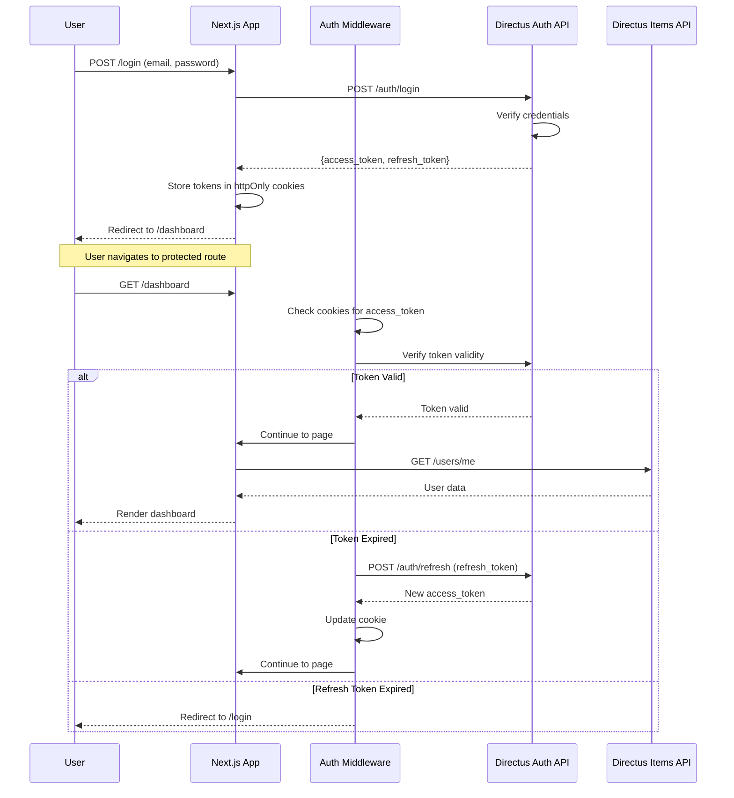
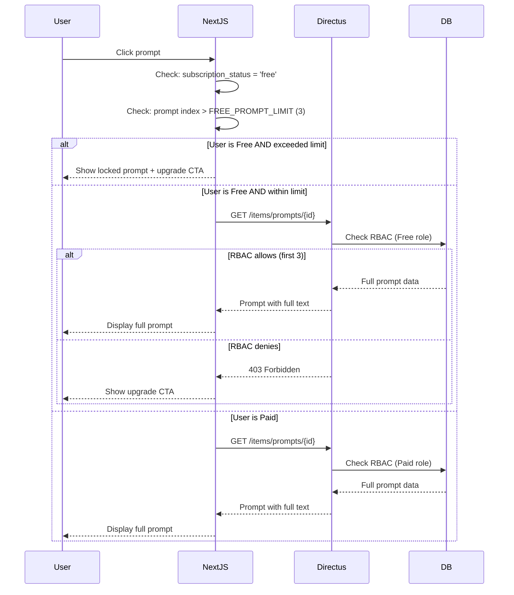
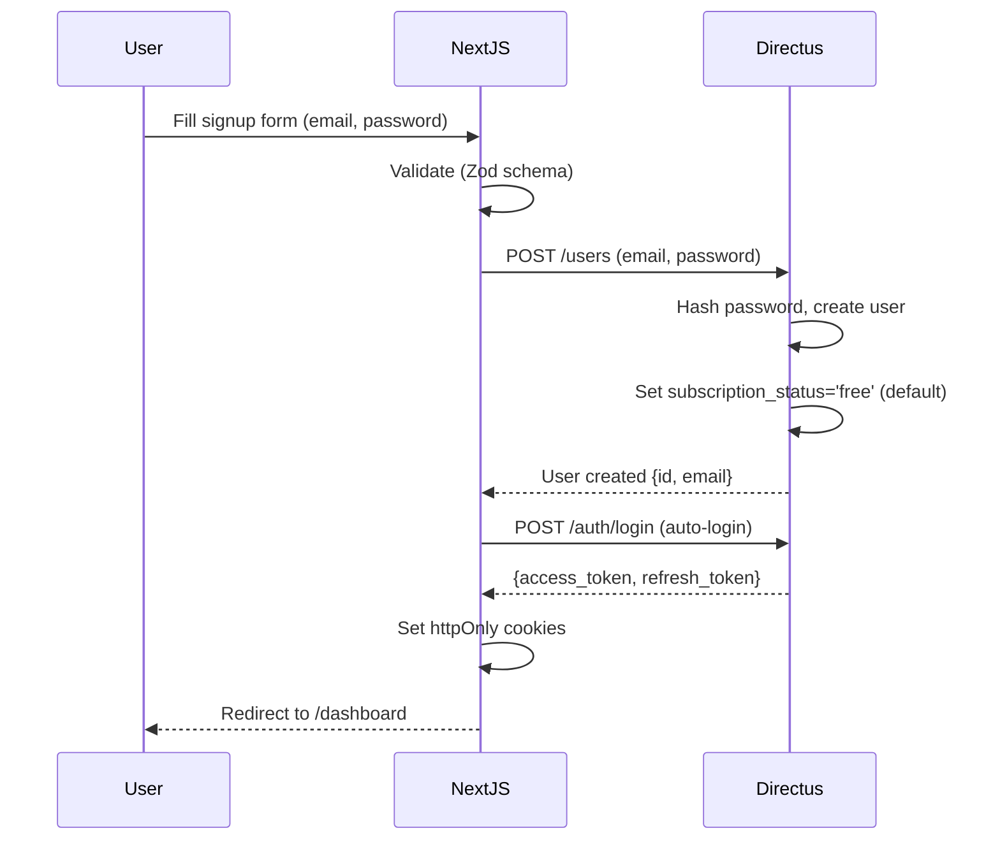
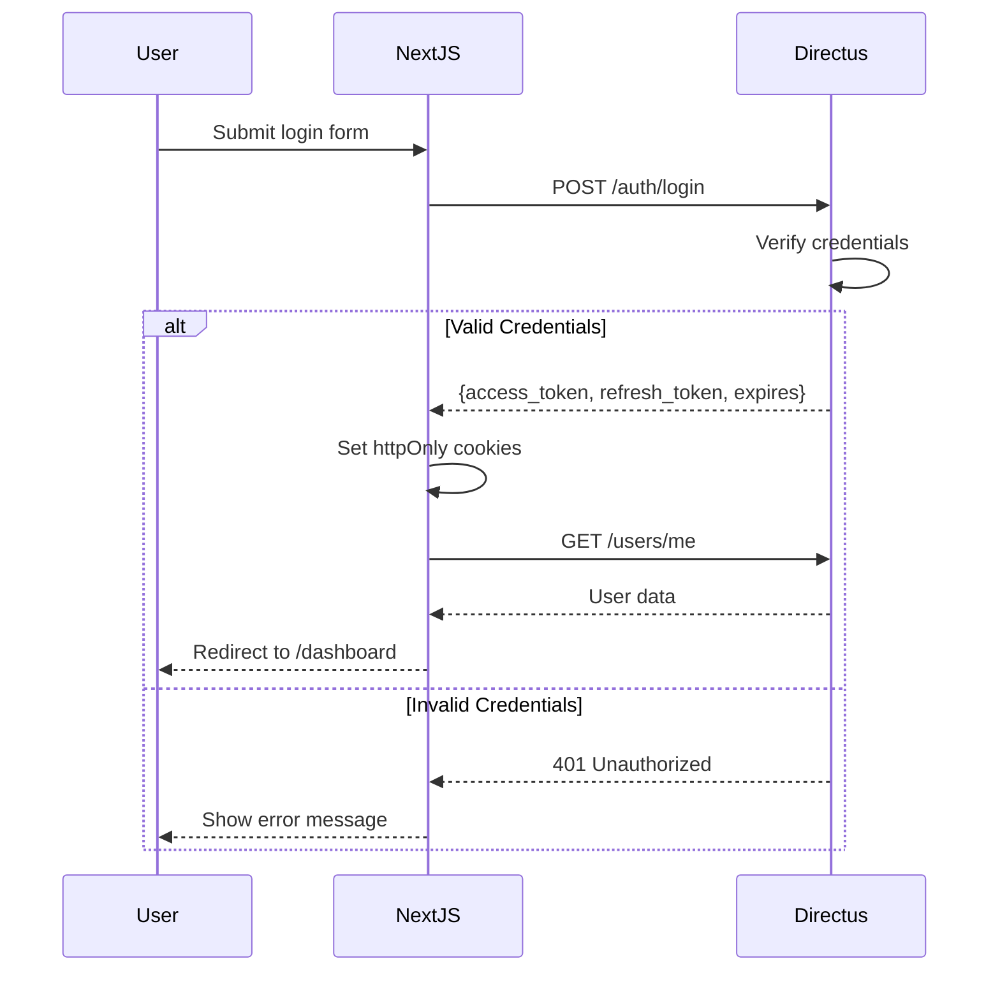
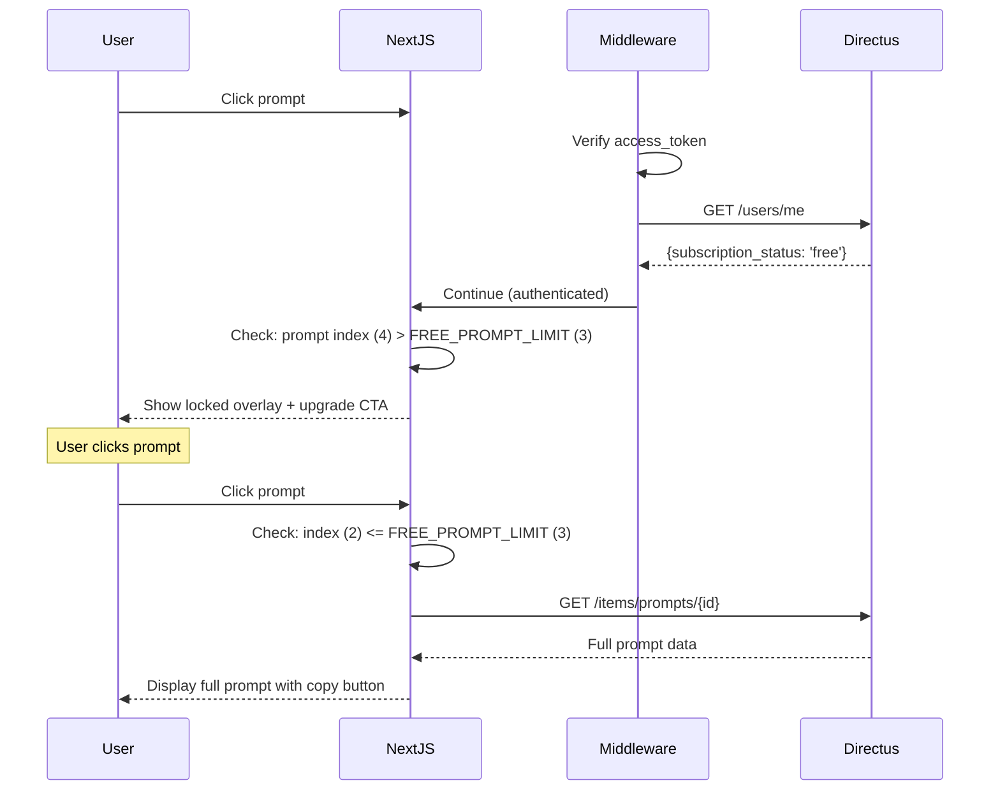
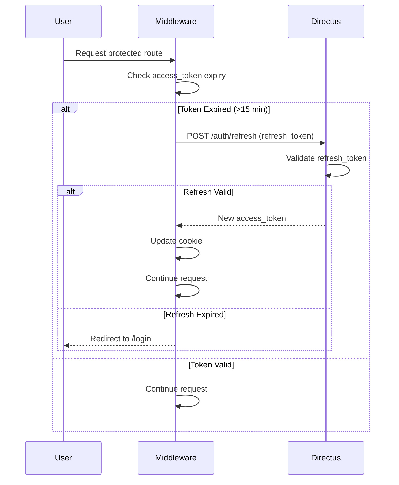

# Epic 3: Authentication & Access Control
## Architecture Shard

**Epic Scope:** Implement user authentication, freemium access control (3 free prompts), user dashboard, and session management.

**Stories Covered:** Stories 17-24 from PRD Epic 3

---

## Quick Context

This shard introduces user accounts and the freemium business model. At the end of this epic, users can register, log in, browse 3 prompts for free, and see upgrade prompts for locked content.

**What's IN scope:**
- User registration and login (Directus JWT)
- Session management with httpOnly cookies
- Freemium access control (first 3 prompts unlocked)
- User dashboard (view subscription status)
- Protected routes (middleware)
- RBAC configuration (Free vs Paid roles)
- Logout functionality

**What's OUT of scope (next epic):**
- Stripe payment integration (Epic 4)
- Subscription purchase flow (Epic 4)
- Upgrade to paid (Epic 4)

**Prerequisites from Previous Epics:**
- Next.js application with prompt browsing (Epic 1)
- Full prompt library with search (Epic 2)

---

## Enhanced Data Models

### User (Extended Directus User)

```typescript
// types/User.ts
export type SubscriptionStatus = 'free' | 'paid';
export type UserStatus = 'active' | 'suspended' | 'archived';

export interface User {
  id: string;
  email: string;
  subscription_status: SubscriptionStatus;
  stripe_customer_id: string | null;
  stripe_subscription_id: string | null;
  subscription_expires_at: string | null; // ISO 8601 date string
  date_created: string;
  date_updated: string;
  status: UserStatus;
}

// Frontend-safe user (excludes sensitive fields)
export type PublicUser = Omit<User, 'stripe_customer_id' | 'stripe_subscription_id'>;

// Auth response
export interface AuthResponse {
  access_token: string;
  refresh_token: string;
  expires: number; // milliseconds
}
```

### Database Schema Additions

```sql
-- Extend directus_users table
ALTER TABLE directus_users
ADD COLUMN IF NOT EXISTS subscription_status VARCHAR(20) DEFAULT 'free',
ADD COLUMN IF NOT EXISTS stripe_customer_id VARCHAR(255),
ADD COLUMN IF NOT EXISTS stripe_subscription_id VARCHAR(255),
ADD COLUMN IF NOT EXISTS subscription_expires_at TIMESTAMP WITH TIME ZONE;

-- Add indexes
CREATE INDEX idx_users_subscription_status ON directus_users(subscription_status);
CREATE INDEX idx_users_stripe_customer ON directus_users(stripe_customer_id);

-- Add check constraint
ALTER TABLE directus_users
ADD CONSTRAINT chk_subscription_status CHECK (subscription_status IN ('free', 'paid'));
```

---

## Authentication Architecture

### JWT Token Flow



### Cookie Configuration

```typescript
// lib/auth/cookies.ts
export const COOKIE_CONFIG = {
  access_token: {
    name: 'directus_access_token',
    httpOnly: true,
    secure: process.env.NODE_ENV === 'production',
    sameSite: 'lax' as const,
    path: '/',
    maxAge: 15 * 60, // 15 minutes
  },
  refresh_token: {
    name: 'directus_refresh_token',
    httpOnly: true,
    secure: process.env.NODE_ENV === 'production',
    sameSite: 'lax' as const,
    path: '/',
    maxAge: 7 * 24 * 60 * 60, // 7 days
  },
};
```

---

## Freemium Access Control

### Access Control Rules

**Free Users (subscription_status = 'free'):**
- See all prompts in library (cards with title, description)
- Access full text of first 3 prompts (configurable via `FREE_PROMPT_LIMIT`)
- Remaining prompts show "Upgrade to unlock" overlay
- Can browse, search, filter all prompts

**Paid Users (subscription_status = 'paid'):**
- Full access to all prompts
- No limitations

**Enforcement Layers:**
1. **Directus RBAC:** API-level access control (security-in-depth)
2. **Frontend Logic:** UI shows lock icons and upgrade CTAs
3. **Environment Variable:** `FREE_PROMPT_LIMIT=3` (configurable)

### Access Control Flow



---

## Directus RBAC Configuration

### Roles & Permissions

**1. Public Role (Unauthenticated)**
- Read: `prompts` (status=published), `categories`, `job_roles`
- Fields: All except `prompt_text` (metadata only for browsing)
- No write access

**2. Free User Role (Authenticated, subscription_status=free)**
- Read: `prompts` (status=published), full access to first 3 prompts
- Read: `categories`, `job_roles`
- Read: Own user record (`/users/me`)
- Update: Own user profile (limited fields)
- No write access to prompts

**3. Paid User Role (Authenticated, subscription_status=paid)**
- Read: All published prompts with full `prompt_text`
- Read: `categories`, `job_roles`
- Read: Own user record
- Update: Own user profile
- No write access to prompts

**4. Administrator Role**
- Full CRUD on all collections
- Access to Directus admin UI
- User management

### RBAC Implementation (Directus Rules)

**Free User - Prompts Collection:**
```json
{
  "role": "free_user",
  "collection": "prompts",
  "permissions": {
    "read": {
      "status": {
        "_eq": "published"
      }
    }
  },
  "fields": ["*"],
  "limit": null,
  "validation": null
}
```

**Note:** Freemium logic (first 3 prompts) enforced at application layer (Next.js) for simplicity. Alternative: Use Directus Flows for complex rules.

---

## Frontend Architecture

### Updated Component Structure

```
app/
├── (auth)/                      # Auth route group
│   ├── login/
│   │   └── page.tsx             # NEW: Login page
│   ├── signup/
│   │   └── page.tsx             # NEW: Signup page
│   └── layout.tsx               # Auth layout (no header/footer)
├── dashboard/
│   ├── page.tsx                 # NEW: User dashboard
│   └── layout.tsx               # Protected layout
├── middleware.ts                # NEW: Auth middleware
└── api/
    └── auth/
        └── logout/route.ts      # NEW: Logout endpoint

components/
├── auth/
│   ├── LoginForm.tsx            # NEW: Login form
│   ├── SignupForm.tsx           # NEW: Signup form
│   └── AuthGuard.tsx            # NEW: Client-side auth check
├── dashboard/
│   ├── ProfileCard.tsx          # NEW: User profile
│   └── SubscriptionCard.tsx    # NEW: Subscription status
├── prompts/
│   ├── PromptCard.tsx           # ENHANCED: Show lock icon
│   ├── PromptDetail.tsx         # ENHANCED: Access control
│   └── UpgradeCTA.tsx           # NEW: Upgrade prompt
└── layout/
    └── Header.tsx               # ENHANCED: Show user menu

lib/
├── auth/
│   ├── client.ts                # NEW: Auth client utilities
│   ├── cookies.ts               # NEW: Cookie helpers
│   ├── session.ts               # NEW: Session management
│   └── middleware.ts            # NEW: Middleware helpers
├── context/
│   └── AuthContext.tsx          # NEW: Auth context provider
└── hooks/
    └── useAuth.ts               # NEW: Auth hook
```

---

## Core Workflows

### 1. User Registration



### 2. User Login



### 3. Access Protected Prompt (Free User)



### 4. Token Refresh (Automatic)



---

## Key Code Patterns

### 1. Auth Middleware

```typescript
// middleware.ts
import { NextResponse } from 'next/server';
import type { NextRequest } from 'next/server';
import { verifyAuth, refreshToken } from '@/lib/auth/session';

export async function middleware(request: NextRequest) {
  const { pathname } = request.nextUrl;

  // Protect routes starting with /dashboard
  if (pathname.startsWith('/dashboard')) {
    const accessToken = request.cookies.get('directus_access_token')?.value;
    const refreshTokenValue = request.cookies.get('directus_refresh_token')?.value;

    if (!accessToken && !refreshTokenValue) {
      return NextResponse.redirect(new URL('/login', request.url));
    }

    // Verify token
    const isValid = await verifyAuth(accessToken);

    if (!isValid && refreshTokenValue) {
      // Try to refresh
      const newToken = await refreshToken(refreshTokenValue);

      if (newToken) {
        const response = NextResponse.next();
        response.cookies.set('directus_access_token', newToken, {
          httpOnly: true,
          secure: process.env.NODE_ENV === 'production',
          sameSite: 'lax',
          maxAge: 15 * 60,
        });
        return response;
      }

      // Refresh failed
      return NextResponse.redirect(new URL('/login', request.url));
    }

    if (!isValid) {
      return NextResponse.redirect(new URL('/login', request.url));
    }
  }

  return NextResponse.next();
}

export const config = {
  matcher: ['/dashboard/:path*'],
};
```

### 2. Auth Context Provider

```typescript
// lib/context/AuthContext.tsx
'use client';

import { createContext, useContext, useState, useEffect, ReactNode } from 'react';
import { getCurrentUser } from '@/lib/auth/client';
import type { PublicUser } from '@/types/User';

interface AuthContextType {
  user: PublicUser | null;
  isLoading: boolean;
  isAuthenticated: boolean;
  refresh: () => Promise<void>;
  logout: () => Promise<void>;
}

const AuthContext = createContext<AuthContextType | undefined>(undefined);

export function AuthProvider({ children, initialUser }: { children: ReactNode; initialUser?: PublicUser | null }) {
  const [user, setUser] = useState<PublicUser | null>(initialUser || null);
  const [isLoading, setIsLoading] = useState(!initialUser);

  useEffect(() => {
    if (!initialUser) {
      refresh();
    }
  }, [initialUser]);

  const refresh = async () => {
    setIsLoading(true);
    try {
      const currentUser = await getCurrentUser();
      setUser(currentUser);
    } catch (error) {
      setUser(null);
    } finally {
      setIsLoading(false);
    }
  };

  const logout = async () => {
    await fetch('/api/auth/logout', { method: 'POST' });
    setUser(null);
    window.location.href = '/';
  };

  return (
    <AuthContext.Provider
      value={{
        user,
        isLoading,
        isAuthenticated: !!user,
        refresh,
        logout,
      }}
    >
      {children}
    </AuthContext.Provider>
  );
}

export function useAuth() {
  const context = useContext(AuthContext);
  if (context === undefined) {
    throw new Error('useAuth must be used within an AuthProvider');
  }
  return context;
}
```

### 3. Login Form Component

```typescript
// components/auth/LoginForm.tsx
'use client';

import { useState } from 'react';
import { useRouter } from 'next/navigation';
import { useForm } from 'react-hook-form';
import { zodResolver } from '@hookform/resolvers/zod';
import { z } from 'zod';
import { login } from '@/lib/auth/client';

const loginSchema = z.object({
  email: z.string().email('Invalid email address'),
  password: z.string().min(8, 'Password must be at least 8 characters'),
});

type LoginFormData = z.infer<typeof loginSchema>;

export default function LoginForm() {
  const router = useRouter();
  const [error, setError] = useState<string | null>(null);
  const [isLoading, setIsLoading] = useState(false);

  const {
    register,
    handleSubmit,
    formState: { errors },
  } = useForm<LoginFormData>({
    resolver: zodResolver(loginSchema),
  });

  const onSubmit = async (data: LoginFormData) => {
    setIsLoading(true);
    setError(null);

    try {
      await login(data.email, data.password);
      router.push('/dashboard');
      router.refresh();
    } catch (err) {
      setError(err instanceof Error ? err.message : 'Login failed. Please check your credentials.');
    } finally {
      setIsLoading(false);
    }
  };

  return (
    <form onSubmit={handleSubmit(onSubmit)} className="space-y-6">
      {error && (
        <div className="rounded-md bg-red-50 p-4">
          <p className="text-sm text-red-800">{error}</p>
        </div>
      )}

      <div>
        <label htmlFor="email" className="block text-sm font-medium text-gray-700">
          Email
        </label>
        <input
          {...register('email')}
          type="email"
          id="email"
          className="mt-1 block w-full rounded-md border border-gray-300 px-3 py-2 focus:border-blue-500 focus:outline-none focus:ring-blue-500"
        />
        {errors.email && <p className="mt-1 text-sm text-red-600">{errors.email.message}</p>}
      </div>

      <div>
        <label htmlFor="password" className="block text-sm font-medium text-gray-700">
          Password
        </label>
        <input
          {...register('password')}
          type="password"
          id="password"
          className="mt-1 block w-full rounded-md border border-gray-300 px-3 py-2 focus:border-blue-500 focus:outline-none focus:ring-blue-500"
        />
        {errors.password && <p className="mt-1 text-sm text-red-600">{errors.password.message}</p>}
      </div>

      <button
        type="submit"
        disabled={isLoading}
        className="w-full rounded-md bg-blue-600 px-4 py-2 text-white hover:bg-blue-700 focus:outline-none focus:ring-2 focus:ring-blue-500 focus:ring-offset-2 disabled:opacity-50"
      >
        {isLoading ? 'Logging in...' : 'Log In'}
      </button>
    </form>
  );
}
```

### 4. Freemium Access Control Logic

```typescript
// lib/utils/access-control.ts
import type { User } from '@/types/User';

const FREE_PROMPT_LIMIT = parseInt(process.env.FREE_PROMPT_LIMIT || '3', 10);

export function canAccessPrompt(user: User | null, promptIndex: number): boolean {
  // Not logged in - no access to full prompts
  if (!user) {
    return false;
  }

  // Paid users have full access
  if (user.subscription_status === 'paid') {
    return true;
  }

  // Free users can access first N prompts
  return promptIndex < FREE_PROMPT_LIMIT;
}

export function getRemainingFreePrompts(user: User | null, viewedCount: number): number {
  if (!user || user.subscription_status === 'paid') {
    return Infinity;
  }

  return Math.max(0, FREE_PROMPT_LIMIT - viewedCount);
}
```

---

## Environment Configuration

**Additional Variables (Epic 3):**

```bash
# .env.local
# ... existing variables from Epic 1-2

# Freemium Configuration
FREE_PROMPT_LIMIT=3

# Session Configuration (optional overrides)
SESSION_SECRET=your-random-secret-key
ACCESS_TOKEN_EXPIRY=900           # 15 minutes in seconds
REFRESH_TOKEN_EXPIRY=604800       # 7 days in seconds
```

---

## Security Considerations

**Authentication Security:**
- JWT tokens stored in httpOnly cookies (XSS immune)
- Secure flag enabled in production (HTTPS only)
- SameSite=Lax (CSRF protection)
- 15-minute access token expiry (balance security/UX)
- 7-day refresh token with automatic rotation
- Password hashing handled by Directus (bcrypt)

**Authorization Security:**
- RBAC enforced at API level (security-in-depth)
- Frontend checks as UX enhancement only
- No sensitive data in JWT payload
- User role verified on every API request

**Session Security:**
- No localStorage (XSS vulnerable)
- No sessionStorage
- Automatic token refresh (transparent to user)
- Logout invalidates refresh token server-side

---

## Testing Checklist (Epic 3)

**Manual Tests:**
- [ ] Sign up with new email - creates account
- [ ] Sign up with existing email - shows error
- [ ] Log in with valid credentials - redirects to dashboard
- [ ] Log in with invalid credentials - shows error
- [ ] Access /dashboard without login - redirects to /login
- [ ] Dashboard shows user email and subscription status
- [ ] Free user sees first 3 prompts unlocked
- [ ] Free user sees prompts 4+ with lock icon
- [ ] Free user clicks locked prompt - sees upgrade CTA
- [ ] Paid user (manually set) sees all prompts unlocked
- [ ] Logout clears session and redirects to home
- [ ] Token refresh works automatically (wait 16 min)
- [ ] Session expires after 7 days (manual test)
- [ ] Mobile responsive (all auth pages)

**Unit Tests (Selective):**
- Access control logic (`canAccessPrompt`)
- Token verification
- Cookie helpers

---

## Epic 3 Completion Criteria

**Definition of Done:**
- [x] User registration working
- [x] User login/logout working
- [x] JWT authentication with httpOnly cookies
- [x] Middleware protecting /dashboard routes
- [x] User dashboard displaying subscription status
- [x] Freemium access control (first 3 prompts)
- [x] Lock icons and upgrade CTAs on restricted prompts
- [x] Automatic token refresh working
- [x] RBAC configured in Directus (Free vs Paid roles)
- [x] TypeScript compiles with zero errors
- [x] Manual test checklist passed
- [x] Security review passed

**Next Epic:** Epic 4 - Subscription & Payment (Stripe integration, webhook handling)

---

**Shard Version:** 1.0
**Last Updated:** 2025-11-09
**Parent Document:** architecture.md v1.0
