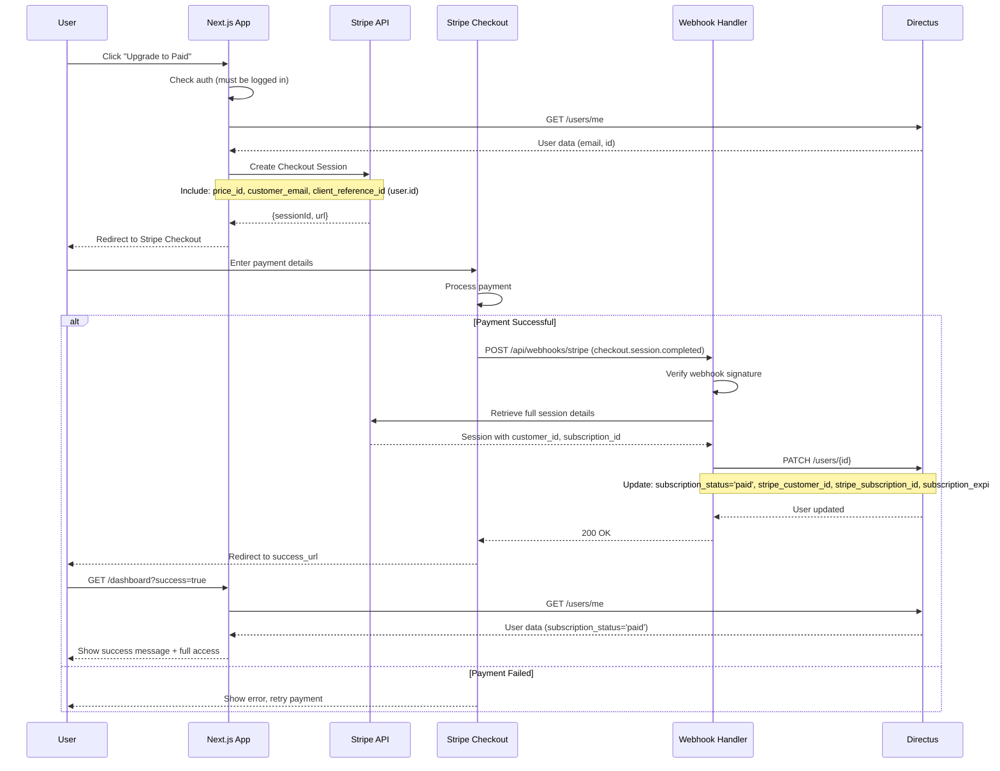
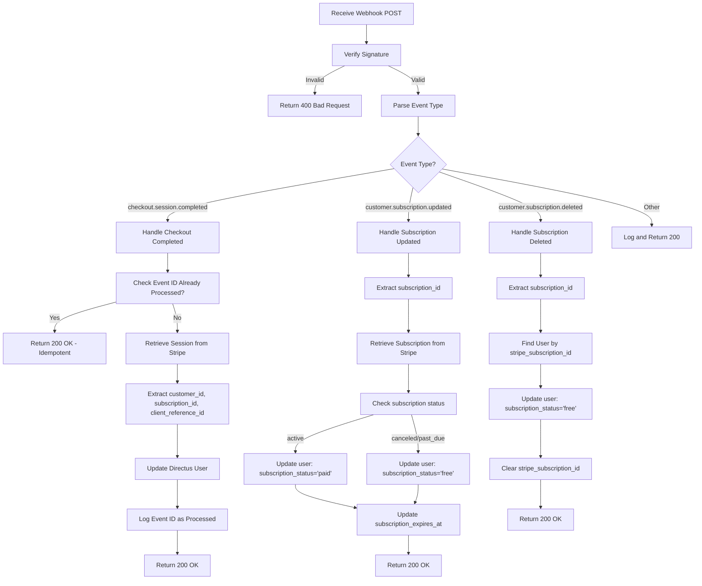
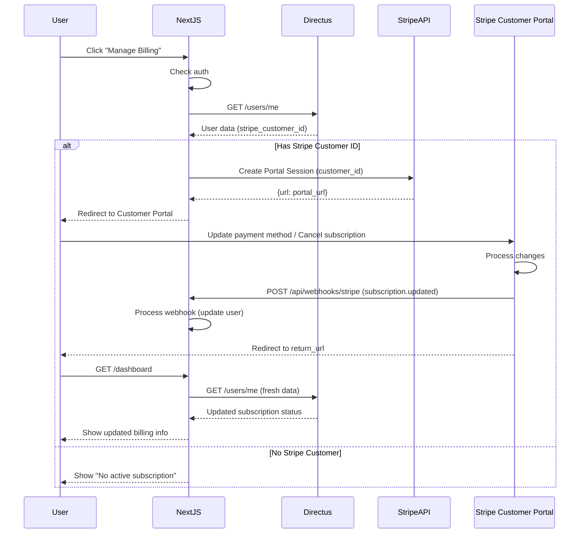

# Epic 4: Subscription & Payment
## Architecture Shard

**Epic Scope:** Integrate Stripe Checkout, handle webhooks, sync subscription status, enable Customer Portal for self-service billing.

**Stories Covered:** Stories 25-32 from PRD Epic 4

---

## Quick Context

This shard completes the MVP by adding payment processing and subscription management. At the end of this epic, users can upgrade to paid subscriptions, access all prompts, and manage billing through Stripe Customer Portal.

**What's IN scope:**
- Stripe Checkout integration (hosted payment)
- Stripe webhook handler (subscription events)
- Subscription sync to Directus (update user records)
- Customer Portal integration (self-service billing)
- Upgrade flow (free to paid)
- Payment error handling
- Webhook idempotency and retry logic

**What's OUT of scope (Post-MVP):**
- Multiple subscription tiers
- Annual billing
- Promo codes/discounts
- Subscription analytics dashboard
- Failed payment recovery emails

**Prerequisites from Previous Epics:**
- User authentication working (Epic 3)
- Freemium access control implemented (Epic 3)
- User dashboard available (Epic 3)

---

## Stripe Integration Architecture

### Stripe Components

**1. Stripe Checkout (Hosted Payment Page)**
- Purpose: Handle payment collection securely
- Flow: User clicks "Upgrade" → Redirects to Stripe → Payment → Webhook → Redirect back
- Benefits: PCI compliance, mobile-optimized, supports multiple payment methods

**2. Stripe Customer Portal (Hosted Billing Management)**
- Purpose: Self-service subscription management
- Features: Update payment method, cancel subscription, view invoices
- Flow: User clicks "Manage Billing" → Redirects to Stripe Portal → Return to app

**3. Stripe Webhooks**
- Purpose: Notify app of subscription events asynchronously
- Events: `checkout.session.completed`, `customer.subscription.updated`, `customer.subscription.deleted`
- Delivery: HTTPS POST to `/api/webhooks/stripe`

---

## Data Model (No Changes)

Epic 4 uses existing User model fields added in Epic 3:
- `subscription_status`: 'free' | 'paid'
- `stripe_customer_id`: Links to Stripe Customer
- `stripe_subscription_id`: Current active subscription
- `subscription_expires_at`: Renewal/expiry date

---

## API Endpoints (New)

### Next.js API Routes

#### 1. Create Checkout Session

```typescript
// POST /api/checkout/create-session
// Purpose: Create Stripe Checkout Session for subscription purchase

Request Body:
{
  "priceId": "price_xxx",  // Stripe Price ID
  "successUrl": "https://app.com/dashboard?success=true",
  "cancelUrl": "https://app.com/upgrade?canceled=true"
}

Response:
{
  "sessionId": "cs_test_xxx",
  "url": "https://checkout.stripe.com/pay/cs_test_xxx"
}
```

#### 2. Create Customer Portal Session

```typescript
// POST /api/billing/create-portal-session
// Purpose: Create Stripe Customer Portal session for billing management

Request Body:
{
  "returnUrl": "https://app.com/dashboard"
}

Response:
{
  "url": "https://billing.stripe.com/session/xxx"
}
```

#### 3. Stripe Webhook Handler

```typescript
// POST /api/webhooks/stripe
// Purpose: Receive and process Stripe webhook events

Headers:
{
  "stripe-signature": "t=xxx,v1=yyy"  // Webhook signature for verification
}

Request Body:
{
  "id": "evt_xxx",
  "type": "checkout.session.completed",
  "data": {
    "object": { /* Stripe object data */ }
  }
}

Response:
{
  "received": true
}
```

---

## Core Workflows

### 1. Upgrade Flow (Free to Paid)



### 2. Webhook Processing (Idempotent)



### 3. Manage Billing (Customer Portal)



---

## Key Code Patterns

### 1. Create Checkout Session

```typescript
// app/api/checkout/create-session/route.ts
import { NextRequest, NextResponse } from 'next/server';
import Stripe from 'stripe';
import { getCurrentUser } from '@/lib/auth/session';

const stripe = new Stripe(process.env.STRIPE_SECRET_KEY!, {
  apiVersion: '2024-11-20',
});

export async function POST(request: NextRequest) {
  try {
    // Verify authentication
    const user = await getCurrentUser(request);
    if (!user) {
      return NextResponse.json({ error: 'Unauthorized' }, { status: 401 });
    }

    // Prevent duplicate subscriptions
    if (user.subscription_status === 'paid') {
      return NextResponse.json(
        { error: 'Already subscribed' },
        { status: 400 }
      );
    }

    // Create Checkout Session
    const session = await stripe.checkout.sessions.create({
      mode: 'subscription',
      payment_method_types: ['card'],
      line_items: [
        {
          price: process.env.STRIPE_PRICE_ID!,
          quantity: 1,
        },
      ],
      customer_email: user.email,
      client_reference_id: user.id, // Link session to our user
      success_url: `${process.env.NEXT_PUBLIC_BASE_URL}/dashboard?success=true`,
      cancel_url: `${process.env.NEXT_PUBLIC_BASE_URL}/upgrade?canceled=true`,
      metadata: {
        user_id: user.id,
      },
    });

    return NextResponse.json({
      sessionId: session.id,
      url: session.url,
    });
  } catch (error) {
    console.error('Checkout session error:', error);
    return NextResponse.json(
      { error: 'Failed to create checkout session' },
      { status: 500 }
    );
  }
}
```

### 2. Stripe Webhook Handler

```typescript
// app/api/webhooks/stripe/route.ts
import { NextRequest, NextResponse } from 'next/server';
import Stripe from 'stripe';
import { createDirectus, rest, updateItem } from '@directus/sdk';

const stripe = new Stripe(process.env.STRIPE_SECRET_KEY!, {
  apiVersion: '2024-11-20',
});

const directus = createDirectus(process.env.DIRECTUS_URL!).with(rest());

// Track processed events for idempotency
const processedEvents = new Set<string>();

export async function POST(request: NextRequest) {
  const body = await request.text();
  const signature = request.headers.get('stripe-signature');

  if (!signature) {
    return NextResponse.json({ error: 'No signature' }, { status: 400 });
  }

  let event: Stripe.Event;

  try {
    // Verify webhook signature
    event = stripe.webhooks.constructEvent(
      body,
      signature,
      process.env.STRIPE_WEBHOOK_SECRET!
    );
  } catch (error) {
    console.error('Webhook signature verification failed:', error);
    return NextResponse.json({ error: 'Invalid signature' }, { status: 400 });
  }

  // Idempotency check
  if (processedEvents.has(event.id)) {
    console.log(`Event ${event.id} already processed`);
    return NextResponse.json({ received: true });
  }

  try {
    switch (event.type) {
      case 'checkout.session.completed':
        await handleCheckoutCompleted(event.data.object as Stripe.Checkout.Session);
        break;

      case 'customer.subscription.updated':
        await handleSubscriptionUpdated(event.data.object as Stripe.Subscription);
        break;

      case 'customer.subscription.deleted':
        await handleSubscriptionDeleted(event.data.object as Stripe.Subscription);
        break;

      default:
        console.log(`Unhandled event type: ${event.type}`);
    }

    // Mark as processed
    processedEvents.add(event.id);

    return NextResponse.json({ received: true });
  } catch (error) {
    console.error('Webhook handler error:', error);
    return NextResponse.json({ error: 'Webhook handler failed' }, { status: 500 });
  }
}

async function handleCheckoutCompleted(session: Stripe.Checkout.Session) {
  const userId = session.client_reference_id || session.metadata?.user_id;

  if (!userId) {
    throw new Error('No user ID in checkout session');
  }

  // Retrieve subscription details
  const subscriptionId = session.subscription as string;
  const subscription = await stripe.subscriptions.retrieve(subscriptionId);

  // Update user in Directus
  await directus.request(
    updateItem('directus_users', userId, {
      subscription_status: 'paid',
      stripe_customer_id: session.customer as string,
      stripe_subscription_id: subscriptionId,
      subscription_expires_at: new Date(subscription.current_period_end * 1000).toISOString(),
    })
  );

  console.log(`User ${userId} upgraded to paid`);
}

async function handleSubscriptionUpdated(subscription: Stripe.Subscription) {
  // Find user by stripe_subscription_id
  const users = await directus.request(
    readItems('directus_users', {
      filter: {
        stripe_subscription_id: { _eq: subscription.id },
      },
      limit: 1,
    })
  );

  if (users.length === 0) {
    console.warn(`No user found for subscription ${subscription.id}`);
    return;
  }

  const user = users[0];
  const status = subscription.status === 'active' ? 'paid' : 'free';

  await directus.request(
    updateItem('directus_users', user.id, {
      subscription_status: status,
      subscription_expires_at: new Date(subscription.current_period_end * 1000).toISOString(),
    })
  );

  console.log(`User ${user.id} subscription status updated to ${status}`);
}

async function handleSubscriptionDeleted(subscription: Stripe.Subscription) {
  const users = await directus.request(
    readItems('directus_users', {
      filter: {
        stripe_subscription_id: { _eq: subscription.id },
      },
      limit: 1,
    })
  );

  if (users.length === 0) {
    console.warn(`No user found for subscription ${subscription.id}`);
    return;
  }

  const user = users[0];

  await directus.request(
    updateItem('directus_users', user.id, {
      subscription_status: 'free',
      stripe_subscription_id: null,
      subscription_expires_at: null,
    })
  );

  console.log(`User ${user.id} subscription canceled`);
}
```

### 3. Customer Portal Session

```typescript
// app/api/billing/create-portal-session/route.ts
import { NextRequest, NextResponse } from 'next/server';
import Stripe from 'stripe';
import { getCurrentUser } from '@/lib/auth/session';

const stripe = new Stripe(process.env.STRIPE_SECRET_KEY!, {
  apiVersion: '2024-11-20',
});

export async function POST(request: NextRequest) {
  try {
    const user = await getCurrentUser(request);

    if (!user) {
      return NextResponse.json({ error: 'Unauthorized' }, { status: 401 });
    }

    if (!user.stripe_customer_id) {
      return NextResponse.json(
        { error: 'No Stripe customer found' },
        { status: 400 }
      );
    }

    // Create Customer Portal session
    const session = await stripe.billingPortal.sessions.create({
      customer: user.stripe_customer_id,
      return_url: `${process.env.NEXT_PUBLIC_BASE_URL}/dashboard`,
    });

    return NextResponse.json({ url: session.url });
  } catch (error) {
    console.error('Portal session error:', error);
    return NextResponse.json(
      { error: 'Failed to create portal session' },
      { status: 500 }
    );
  }
}
```

### 4. Upgrade Button Component

```typescript
// components/dashboard/UpgradeButton.tsx
'use client';

import { useState } from 'react';
import { useRouter } from 'next/navigation';

export default function UpgradeButton() {
  const router = useRouter();
  const [isLoading, setIsLoading] = useState(false);

  const handleUpgrade = async () => {
    setIsLoading(true);

    try {
      const response = await fetch('/api/checkout/create-session', {
        method: 'POST',
        headers: { 'Content-Type': 'application/json' },
      });

      const data = await response.json();

      if (response.ok && data.url) {
        // Redirect to Stripe Checkout
        window.location.href = data.url;
      } else {
        alert(data.error || 'Failed to start checkout');
        setIsLoading(false);
      }
    } catch (error) {
      console.error('Upgrade error:', error);
      alert('Something went wrong. Please try again.');
      setIsLoading(false);
    }
  };

  return (
    <button
      onClick={handleUpgrade}
      disabled={isLoading}
      className="rounded-lg bg-blue-600 px-6 py-3 font-semibold text-white hover:bg-blue-700 focus:outline-none focus:ring-2 focus:ring-blue-500 focus:ring-offset-2 disabled:opacity-50"
    >
      {isLoading ? 'Redirecting...' : 'Upgrade to Paid'}
    </button>
  );
}
```

---

## Environment Configuration

**Required Variables (Epic 4):**

```bash
# .env.local
# ... existing variables from Epic 1-3

# Stripe Configuration
NEXT_PUBLIC_STRIPE_PUBLISHABLE_KEY=pk_test_xxx
STRIPE_SECRET_KEY=sk_test_xxx
STRIPE_WEBHOOK_SECRET=whsec_xxx
STRIPE_PRICE_ID=price_xxx

# URLs
NEXT_PUBLIC_BASE_URL=http://localhost:3000
```

**Stripe Setup Steps:**
1. Create Stripe account (test mode)
2. Create Product: "CharGPT Bible Subscription"
3. Create Price: $15-25/month (recurring)
4. Copy Price ID to `STRIPE_PRICE_ID`
5. Create Webhook endpoint: `/api/webhooks/stripe`
6. Select events: `checkout.session.completed`, `customer.subscription.updated`, `customer.subscription.deleted`
7. Copy Webhook Secret to `STRIPE_WEBHOOK_SECRET`

---

## Webhook Idempotency Strategy

### Problem
- Stripe may send duplicate webhook events (network retries)
- Processing same event twice could cause data corruption

### Solution

**In-Memory Set (MVP):**
```typescript
const processedEvents = new Set<string>();

if (processedEvents.has(event.id)) {
  return NextResponse.json({ received: true });
}
```

**Post-MVP (Production):**
- Store processed event IDs in Directus collection
- Add TTL (keep for 30 days, then delete)
- Query before processing: `SELECT id FROM webhook_events WHERE event_id = ?`

---

## Error Handling

### Payment Failures

**Scenario 1: Card Declined**
- Stripe shows error on Checkout page
- User can retry with different card
- No webhook sent (no user update needed)

**Scenario 2: Webhook Delivery Failure**
- Stripe automatically retries (exponential backoff)
- Next.js API route should be idempotent
- If all retries fail, manually reconcile via Stripe Dashboard

**Scenario 3: Subscription Cancellation**
- User cancels via Customer Portal
- Webhook: `customer.subscription.deleted`
- Handler updates user to `subscription_status='free'`
- User retains access until `subscription_expires_at`

---

## Testing Strategy

### Stripe Test Mode

**Test Card Numbers:**
- **Success:** `4242 4242 4242 4242`
- **Declined:** `4000 0000 0000 0002`
- **Requires 3D Secure:** `4000 0025 0000 3155`

**Webhook Testing:**
```bash
# Install Stripe CLI
stripe listen --forward-to localhost:3000/api/webhooks/stripe

# Trigger test event
stripe trigger checkout.session.completed
```

### Manual Test Checklist (Epic 4)

**Upgrade Flow:**
- [ ] Click "Upgrade" from dashboard
- [ ] Redirects to Stripe Checkout
- [ ] Enter test card `4242 4242 4242 4242`
- [ ] Complete payment
- [ ] Redirects back to dashboard with success message
- [ ] Dashboard shows "Paid" subscription status
- [ ] All prompts now unlocked (no lock icons)

**Webhook Processing:**
- [ ] Webhook signature verification works
- [ ] `checkout.session.completed` updates user to paid
- [ ] `customer.subscription.updated` updates expiry date
- [ ] `customer.subscription.deleted` downgrades to free
- [ ] Duplicate events ignored (idempotency)
- [ ] Invalid signatures return 400

**Customer Portal:**
- [ ] Click "Manage Billing" from dashboard
- [ ] Redirects to Stripe Customer Portal
- [ ] Can view invoices
- [ ] Can update payment method
- [ ] Can cancel subscription
- [ ] Cancel triggers webhook, user downgraded
- [ ] Return to app shows updated status

**Error Handling:**
- [ ] Declined card shows error on Stripe Checkout
- [ ] Webhook timeout (simulate) retries successfully
- [ ] Already-paid user can't create duplicate subscription
- [ ] User without stripe_customer_id can't access Customer Portal

---

## Performance Considerations

### Webhook Performance
- **Target:** <10 seconds total processing time
- **Optimization:** Minimal Directus API calls (single UPDATE per event)
- **Async Processing:** Webhook returns 200 OK immediately, logs in background

### Checkout Performance
- **Target:** <2 seconds to create Checkout Session
- **Optimization:** Stripe API is fast, minimal pre-flight checks

---

## Security Considerations

**Webhook Security:**
- ALWAYS verify webhook signature (prevents spoofing)
- Use `STRIPE_WEBHOOK_SECRET` from Stripe Dashboard
- Reject requests with invalid/missing signatures

**API Route Security:**
- Checkout: Requires authentication (check user session)
- Portal: Requires authentication + valid stripe_customer_id
- Webhooks: Public endpoint (signature verification is auth)

**Data Security:**
- Never store card numbers (Stripe handles)
- Never expose Stripe secret keys client-side
- stripe_customer_id and stripe_subscription_id in database are safe (not sensitive PII)

---

## MCP Integration (Development)

**MCP Stripe Server Benefits:**
- Test webhook events without Stripe CLI
- Validate Checkout Session configuration
- Simulate subscription lifecycle events
- Debug webhook payload structure

**Example MCP Usage:**
```bash
# Via MCP tools
stripe:create_test_event checkout.session.completed
stripe:list_subscriptions customer_id=cus_xxx
stripe:retrieve_checkout_session session_id=cs_xxx
```

---

## Epic 4 Completion Criteria

**Definition of Done:**
- [x] Stripe Checkout integration working
- [x] User can upgrade from free to paid
- [x] Webhook handler processes `checkout.session.completed`
- [x] Webhook handler processes `customer.subscription.updated`
- [x] Webhook handler processes `customer.subscription.deleted`
- [x] Webhook signature verification implemented
- [x] Idempotency check prevents duplicate processing
- [x] Customer Portal integration working
- [x] User can manage subscription (cancel, update payment method)
- [x] Subscription status syncs to Directus correctly
- [x] Paid users have full access to all prompts
- [x] Canceled users revert to free (first 3 prompts)
- [x] Error handling for payment failures
- [x] TypeScript compiles with zero errors
- [x] Manual test checklist passed
- [x] Webhook testing with Stripe CLI completed

**MVP Complete!** All 4 epics finished. Application ready for production deployment.

---

**Shard Version:** 1.0
**Last Updated:** 2025-11-09
**Parent Document:** architecture.md v1.0
